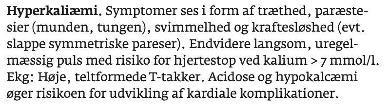
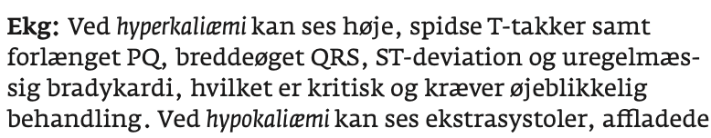
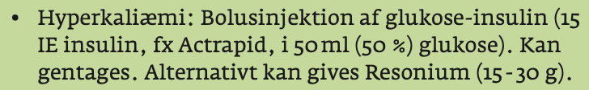
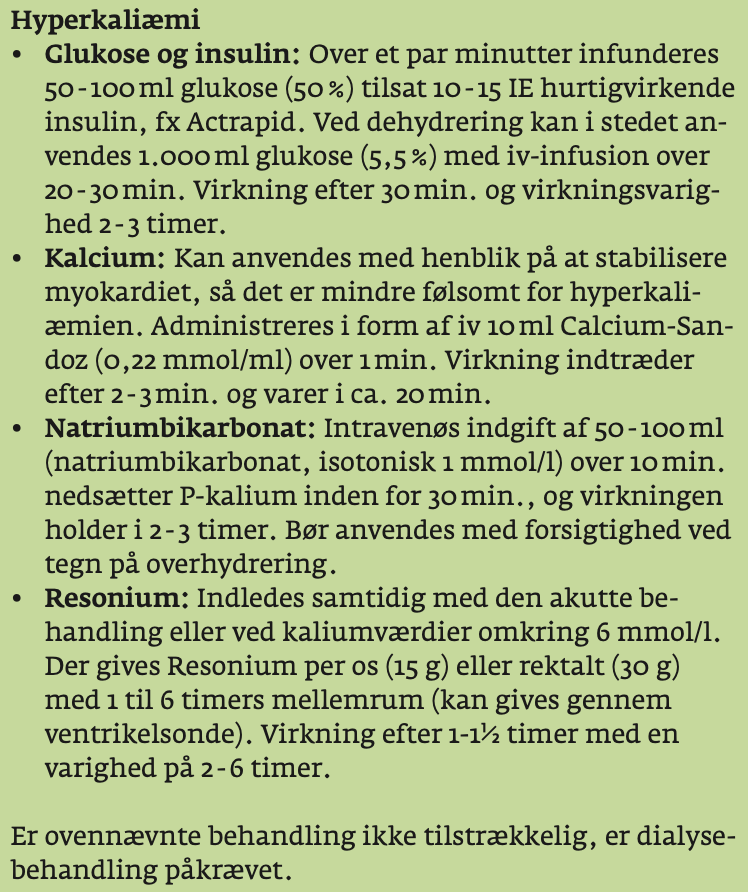

# Hyperkaliæmi
## Generelt

## Differentialdiagnose

## Udredning

### Anamnese

### Objektiv us.

### Paraklinik

## Behandling

## Opfølgning

## Prognose
<!-- #anki/tag/med/Acute care# #anki/tag/med/Nephrology #anki/deck/Medicine -->

<!-- {BearID:E89D349B-4291-4CBA-8DF8-6B440AC98C21-71192-00010B88EE9E16E7} -->
