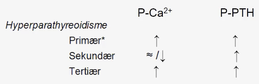

# Hyperparathyroidisme
[[Primær hyperparathyroidisme]]
[[Sekundær hyperparathyroidisme]]
[[Tertiær hyperparathyroidisme]]

## Generelt

Q. Beskriv den ætiologiske forskel på primær, sekundær og tertiær [[Hyperparathyroidisme]].
A. 1) Autonom PTH-produktion, 2) Kompensatorisk pga. langvarig hypocalcæmi (typisk [[D-vitaminmangel]]), 3) Som 2 men med hyperplasi (typisk kronisk nyresygdom)

Q. Hvordan adskiller primær, sekundær og tertiær [[Hyperparathyroidisme]] sig fra hinanden biokemisk?
A. 

## Differentialdiagnose

## Udredning
### Anamnese
Q. Din patient viser symptomer på [[Hyperparathyroidisme]]. Hvad skal tilføjes *anamnesen*? 
A. Som [[Hypercalcæmi]]: 1) Ændret psykiatri, 2) Obstipation, 3) Polyuri/polydipsi, 4) Galde- og nyresten, 5) Muskelsvaghed, 6) Lavenergi-frakturer

Stones ([[Nyresten]], [[Galdesten]]).
Bones ([[Osteoporose]]).
Abdominal groans ([[Obstipation]]).
Psychic moans (kognitiv påvirkning, [[Depression (diagnosis)]]).

### Objektiv us.

### Paraklinik

## Behandling

## Opfølgning

## Prognose

## Backlinks
* [[Træthed]]
	* *E*
[[Hyperparathyroidisme]]
[[Type 2 diabetes]]
[[D-vitaminmangel]]
* [[Hyperparathyroidisme]]
	* Q. Beskriv den ætiologiske forskel på primær, sekundær og tertiær [[Hyperparathyroidisme]].
	* Q. Hvordan adskiller primær, sekundær og tertiær [[Hyperparathyroidisme]] sig fra hinanden biokemisk?
	* Q. Din patient viser symptomer på [[Hyperparathyroidisme]]. Hvad skal tilføjes *anamnesen*? 
* [[Hyperparathyroid hypercalcæmi]]
	* Q. Hvad er de primære årsager til [[Hyperparathyroid hypercalcæmi]]?
* [[Hypoparathyroidisme]]
	* Det modsatte af [[Hyperparathyroidisme]].

<!-- #anki/tag/med/Endocrinology #anki/deck/Medicine -->

<!-- {BearID:42C78E5D-8968-4422-ABC8-CA7B15D4B380-43570-00005B705995B962} -->
