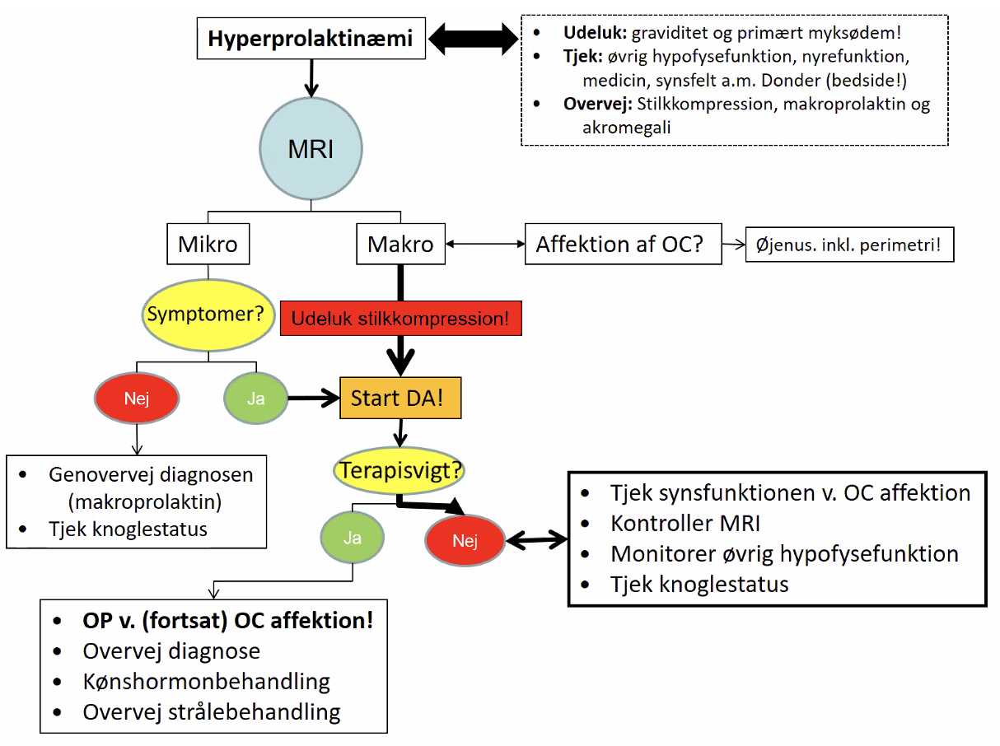

# Hyperprolaktinæmi
## Generelt

## Diagnose
Q. Hvordan diagnosticeres [[Hyperprolaktinæmi]]?
A. p-Prolaktin mindst 2 timer efter opvågning

Q. Hvilke konsekvenser får hyperprolaktinæmi?
A. 1) Øget brystvækst, 2) [[Oligomenorre]]/[[Amenorre]] og 3) [[Infertilitet]]

Q. Hvorfor giver [[Hyperprolaktinæmi]] infertilitet?
A. Hæmmer [[GnRH]] og dermed [[FSH]]/[[LH]]

Q. Hvilke *vaskulære* årsager findes til [[Hyperprolaktinæmi]]?
A. [[Nyreinsufficiens]]

Q. Hvilke *iatrogene* årsager findes til [[Hyperprolaktinæmi]]?
A. Lægemiddelbivirkning (anti-dopaminerge stoffer etc.)

Q. Hvilke *behavioristiske* årsager findes til [[Hyperprolaktinæmi]]?
A. [[Stress]]

Q. Hvilke *endokrine* årsager findes til [[Hyperprolaktinæmi]]?
A. 1) [[Akromegali]], 2) [[Hypothyreose (myxødem)]], 3) [[Graviditet]]

## Behandling
Q. Hvordan behandles [[Hyperprolaktinæmi]]?
A. [[Dopamin-agonist]]. Kun kirurgi ved terapi-svigt eller synsfeltsudfald.

## Opfølgning

## Prognose

## Backlinks
* [[Oligomenorre]]
	* Q. Hvilke *endokrine* årsager findes til [[Oligomenorre]]?
* [[Sekundær hypogonadisme]]
	* Q. Hvilke *endokrine* differentialdiagnoser findes til [[Sekundær hypogonadisme]]?
* [[PCOS]]
	* [[Akromegali]], [[Hyperprolaktinæmi]],  [[Hyperthyreose (for udredning, se Thyrotoxikose)]], [[Hyperthyreose (for udredning, se Thyrotoxikose)]], [[Cushing’s syndrom]], [[Primær hypogonadisme]]
* [[Hyperprolaktinæmi]]
	* Q. Hvordan diagnosticeres [[Hyperprolaktinæmi]]?
	* Q. Hvorfor giver [[Hyperprolaktinæmi]] infertilitet?
	* Q. Hvilke *vaskulære* årsager findes til [[Hyperprolaktinæmi]]?
	* Q. Hvilke *iatrogene* årsager findes til [[Hyperprolaktinæmi]]?
	* Q. Hvilke *behavioristiske* årsager findes til [[Hyperprolaktinæmi]]?
	* Q. Hvilke *endokrine* årsager findes til [[Hyperprolaktinæmi]]?
	* Q. Hvordan behandles [[Hyperprolaktinæmi]]?

<!-- #anki/tag/med/Endocrinology #anki/deck/Medicine #anki/tag/med/Gynecology -->

<!-- {BearID:9705E5B1-E9ED-4BD4-95A9-364746BEF951-966-00001665A3A354DF} -->
