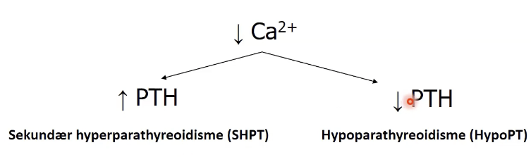
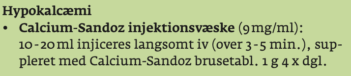

# Hypocalcæmi
## Generelt

## Differentialdiagnose
Q. Hvad er de primære årsager til akut opstået *hypo*calcæmi?
A. 1) Magnesiummangel, 2) Infektion, 3) [[Hyperventilation]], 4) Post-op

Q. Hvorfor giver hyperventilation [[Hypocalcæmi]]?
A. Forskyder pH -> Ændret albuminbinding

## Udredning

### Anamnese
Q. Din patient viser symptomer på [[Hypocalcæmi]]. Hvad skal tilføjes *anamnesen*? 
A. Som: 1) Psykiatriske ændringer, 2) Palpitationer, 3) Paræstesier/småkramper

### Objektiv us.

### Paraklinik
Q. Din patient har [[Hypocalcæmi]]. Hvad vil du tilføje til paraklinikken?
A. 1) [[PTH]], 2) [[D-vitamin]], 3) Nyretal

## Behandling

## Opfølgning

## Prognose

## Backlinks
* [[Hypocalcæmi]]
	* Q. Hvorfor giver hyperventilation [[Hypocalcæmi]]?
	* Q. Din patient viser symptomer på [[Hypocalcæmi]]. Hvad skal tilføjes *anamnesen*? 
	* Q. Din patient har [[Hypocalcæmi]]. Hvad vil du tilføje til paraklinikken?
* [[Hyperventilation]]
	* Q. Hvorfor giver [[Hyperventilation]] [[Paræstesi]]?
* [[Hypoparathyroidisme]]
	* Q. Din patient viser symptomer på [[Hypoparathyroidisme]]. Hvad skal tilføjes *anamnesen*? 
	* Q. Din patient er blevet opereret på halsen, nu er [[PTH]] lav. Hvad nu?
* [[Hypercalcæmi]]
	* Det modsatte af [[Hypocalcæmi]].

<!-- #anki/tag/med/Endocrinology #anki/deck/Medicine -->

<!-- {BearID:D1A4FFC8-BFE5-4044-B69E-E239AD450061-23388-000040188A7483FB} -->
