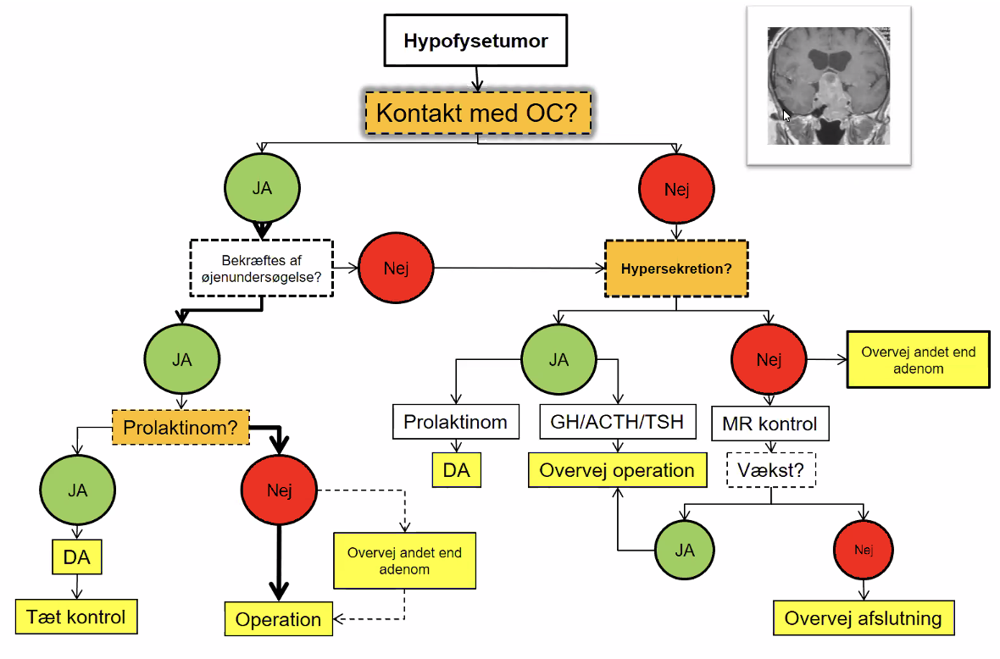

# Hypofysetumor

Q. En patient mistænkes for hypofysetumor. Hvad vil du klinisk undersøge for?
A. 1) Hormoneffekter alt efter symptomer, 2) Kranienerver og 3) Syn

Q. Hvilke hormoner kan [[Hypofyseadenom]] secernere?
A. [[ACTH]], [[TSH]], [[GH]], [[Prolaktin]]

1. [[Hypofyseadenom]]
2. [[Kraniofaryngeom]]
3. Cyster
4. Meningeom
5. Metastase

## Backlinks
* [[Hortons hovedpine]]
	* Q. Hvorfor skal [[Hortons hovedpine]] henvises til neurolog?
* [[Krystalartrit]]
	* Består af [[Hypofysetumor]] og [[Pseudofosfatartrit]].
* [[Prolaktinom]]
	* En sub-type af [[Hypofyseadenom]] som er en [[Hypofysetumor]].

<!-- #anki/tag/med/Endocrinology #anki/deck/Medicine -->

<!-- {BearID:29A5DE67-2B69-4151-987E-440949953E8F-959-00000BC4DBDFE1F3} -->
