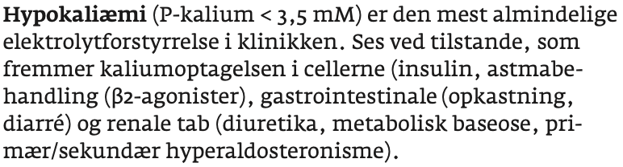
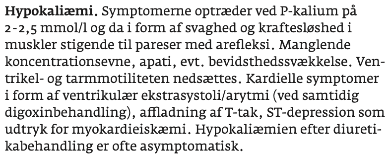
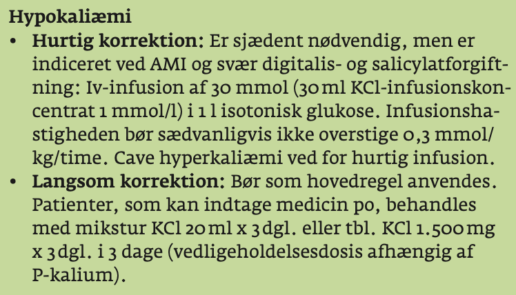

# Hypokaliæmi

## Backlinks
* [[Cushing’s syndrom]]
	* Q. Hvilke akutte biokemiske tilstande kan være tegn på [[Cushing’s syndrom]]?
* [[Primær hyperaldosteronisme]]
	* Q. Din patient har [[Hypertension]] og [[Hypokaliæmi]]. Hvad mistænker du?

<!-- {BearID:38BD1CE5-EFFB-467A-9A30-4B689D3EB02C-21575-0000247A7ABE3748} -->
