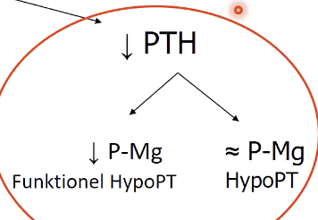
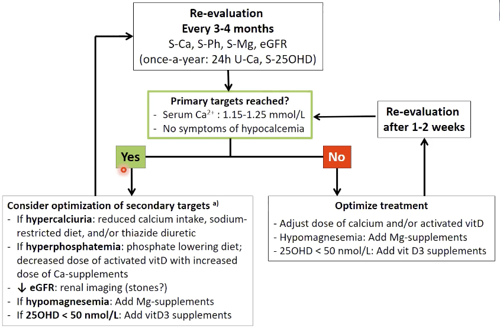
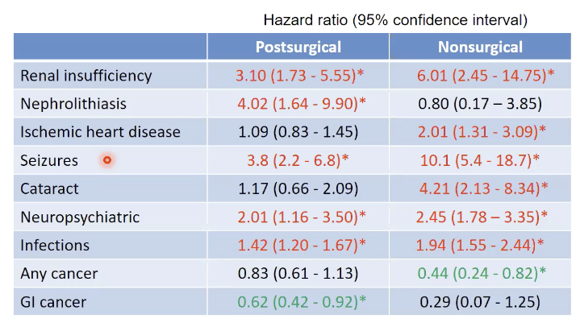

# Hypoparathyroidisme
## Generelt
Det modsatte af [[Hyperparathyroidisme]].

Q. Hvordan påvirker udviklingshastigheden af [[Hypoparathyroidisme]] symptomerne?
A. Hurtigt fald, voldsomme symptomer. Langsomt fald, mere diskrete symptomer.

Q. Hvilken effekt vil [[Hypoparathyroidisme]] have på elektrolytter?
A. Fald i p-Ca, stigning i p-Fosfat.

## Differentialdiagnose

Q. Hvad er de primære årsager til [[Hypoparathyroidisme]]?
A. 1) Kirurgi (thyroidea), 2) Lav s-[[Magnesium]], 3) Genetisk

Desuden traumer, infiltrerende sygdom, bestråling etc.

Q. Hvilke årsager findes til manglende frigivelse af [[PTH]]?
A. 1) Lav s-[[Magnesium]], 2) Genetiske problematikker

## Udredning
### Anamnese
Q. Din patient viser symptomer på [[Hypoparathyroidisme]]. Hvad skal tilføjes *anamnesen*? 
A. Som [[Hypocalcæmi]]: 1) Psykiatriske ændringer, 2) Palpitationer, 3) Paræstesier/småkramper

### Objektiv us.

### Paraklinik
Q. Din patient viser symptomer på [[Hypoparathyroidisme]]. Hvad vil du tilføje til *paraklinikken*? 
A. Hvorfor?) s-[[Magnesium]], Genetisk analyse. Hvor meget?) s-[[PTH]], [[Ca]], [[D-vitamin]]. Hvor slemt?) [[EKG]].

Q. Hvorfor tages s-[[Magnesium]] ved mistanke om [[Hypoparathyroidisme]]?
A. Magnesium er nødvendig for frigivelse af [[PTH]]. Mangel af magnesium -> [[Hypoparathyroidisme]].

## Behandling
Q. Hvordan behandles [[Hypoparathyroidisme]]?
A. Oral 1) D-vitamin, 2) Calcium. *Undgå* 3) Mælk (fosfat) for at undgå nyresten.

Q. Hvilken type vitamin D gives til [[Hypoparathyroidisme]]?
A. Først 1,25. Hvis utilstrækkeligt (Ca2+/D-vitamin), tilføj 1-alfa-hydroxyleret.

## Opfølgning

## Prognose
Q. Din patient er blevet opereret på halsen, nu er [[PTH]] lav. Hvad nu?
A. Vent til 6 mdr., mange kommer sig. Informer om symptomer på [[Hypocalcæmi]].

## Backlinks
* [[Hypoparathyroidisme]]
	* Q. Hvordan påvirker udviklingshastigheden af [[Hypoparathyroidisme]] symptomerne?
	* Q. Hvilken effekt vil [[Hypoparathyroidisme]] have på elektrolytter?
	* Q. Hvad er de primære årsager til [[Hypoparathyroidisme]]?
	* Q. Din patient viser symptomer på [[Hypoparathyroidisme]]. Hvad skal tilføjes *anamnesen*? 
	* Q. Din patient viser symptomer på [[Hypoparathyroidisme]]. Hvad vil du tilføje til *paraklinikken*? 
	* Q. Hvorfor tages s-[[Magnesium]] ved mistanke om [[Hypoparathyroidisme]]?
	* Q. Hvorfor tages s-[[Magnesium]] ved mistanke om [[Hypoparathyroidisme]]?
	* Q. Hvordan behandles [[Hypoparathyroidisme]]?
	* Q. Hvilken type vitamin D gives til [[Hypoparathyroidisme]]?
* [[Osteopetrose]]
	* [[Hypoparathyroidisme]]

<!-- #anki/tag/med/Endocrinology #anki/deck/Medicine -->

<!-- {BearID:09037A9E-4B0F-4ADE-B51E-A8001046DD41-15159-000026A30FAA9346} -->
