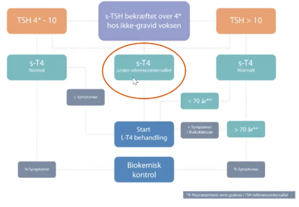

# Hypothyreose (myxødem)
## Generelt
Kan i sjældne tilfælde gå til [[Hypothyreotisk koma]].

## Differentialdiagnose
* [[Primær hypothyreose]] (faktorer der direkte påvirker thyroidea).
	* Klart hyppigst: [[Kronisk autoimmun thyroiditis]]
	* Iatrogent
		* Operation 
		* Medicin
	* Svær jodmangel
	* For meget jod
	* [[Postpartum thyroiditis]]
	* [[Subakut thyroiditis]]
	* [[Stum thyroiditis]]
* Sjældent: [[Central hypothyreose]]
	* Farmaka: dopamin/glukokortikoid
	* Defekt i syntese
	* [[Sekundær hypothyreose]] (insufficient TSH-frigivelse fra hypofyse)
		* Destruktion af TSH-producerende celler
	* [[Tertiær hypothyreose]] (insufficient TRH fra hypothalamus)

Q. Beskriv forskellen på [[Primær hypothyreose]], [[Sekundær hypothyreose]] og [[Tertiær hypothyreose]].
A. Primær skyldes direkte påvirkning af thyroidea. Sekundær utilstrækkelig TSH fra hypofyse. Tertiær utilstrækkelig TRH fra hypothalamus.

Q. Hvad er de primære årsager til [[Hypothyreose (myxødem)]]?
A. 1) Meget hyppigt: [[Kronisk autoimmun thyroiditis]], 2) Mindre hyppigt: Radijod-behandling, 3) Operation i gl. thyroidea, 4) Sjældent: Medicin, 

## Ddx
[[Depression (diagnosis)]]
[[§Anæmi]]
[[Fibromyalgi]]

## Udredning
### Anamnese
Q. Hvilke symptomer vil tyde på [[Hypothyreose (myxødem)]]? 
A. 1) [[Træthed]], 2) [[Obstipation]], 3) Kuldskærhed, 4) [[Muskelsvaghed]]

### Objektiv us.
Q. Din patient viser symptomer på [[Hypothyreose (myxødem)]]. Hvad skal tilføjes *den objektive us.*? 
A. 1) Palper efter struma/knuder, 2) Halsens og thorax’ lymfeknuder, 3) [[St. c.]], 4) Tjek for ødemer

### Paraklinik
Q. Din patient viser symptomer på [[Hypothyreose (myxødem)]]. Hvad vil du tilføje til *paraklinikken*? 
A. 1) [[TSH]], hvis abnorm og ikke-gravid, 2) [[T3]]+[[T4]], 3) [[anti-TPO]]

## Behandling

Q. Din patient har fået diagnosticeres [[Hypothyreose (myxødem)]]. Hvornår bør overvejes henvisning til endokrinolog?
A. 1) Svært regulerbar, 2) Iskæmisk lidelse, 3) Gravid

## Opfølgning

## Prognose

<!-- #anki/tag/med/Endocrinology #anki/deck/Medicine -->

## Backlinks
* [[Hypothyreose (myxødem)]]
	* Q. Hvad er de primære årsager til [[Hypothyreose (myxødem)]]?
	* Q. Hvilke symptomer vil tyde på [[Hypothyreose (myxødem)]]? 
	* Q. Din patient viser symptomer på [[Hypothyreose (myxødem)]]. Hvad skal tilføjes *den objektive us.*? 
	* Q. Din patient viser symptomer på [[Hypothyreose (myxødem)]]. Hvad vil du tilføje til *paraklinikken*? 
	* Q. Din patient har fået diagnosticeres [[Hypothyreose (myxødem)]]. Hvornår bør overvejes henvisning til endokrinolog?
* [[Thyroideasygdom (fortolkning af blodprøver)]]
	* [[Hypothyreose (myxødem)]]
	[[Subklinisk hyperthyreose]]
* [[Graves sygdom]]
	* Q. Din patient med [[Graves sygdom]] veksler nu mellem [[Thyrotoxikose]] og [[Hypothyreose (myxødem)]]. Hvad tænker du?
* [[§Hyponatriæmi]]
	* Q. Hvad er de primære årsager til [[Normohydreret hyponatriæmi]]?
* [[Oligomenorre]]
	* Q. Hvilke *endokrine* årsager findes til [[Oligomenorre]]?
* [[Mb. Calve-Legg-Perthe]]
	* [[Hypothyreose (myxødem)]]
* [[anti-TPO]]
	* Q. Din patient har anti-TPO. Hvad nu?
* [[Obstipation]]
	* Uregelmæssige afføringsvaner
Lavt væskeindtag
Nedsat fysisk aktivitet
Misbrug af afføringsmiddel
Irritabel tyktarm
Lægemiddelbivirkning
[[Hypothyreose (myxødem)]]
Vaginal prolaps 
Kolorektal cancer
* [[§Anæmi]]
	* [[Makrocytær anæmi]], tag flere blodprøver!, se side
	[[Folatmangel]]
	[[Alkoholisme]]
	[[Hæmolyse]]
	[[Myelodysplastisk syndrom]]
	[[Hypothyreose (myxødem)]]
	[[Malign hæmatologisk lidelse]]
* [[Træthed]]
	* Q. Hvilke *endokrine* differentialdiagnoser findes især til [[Træthed]]?
	* *E*
[[Hyperparathyroidisme]]
[[Type 2 diabetes]]
[[D-vitaminmangel]]
* [[Hyperprolaktinæmi]]
	* Q. Hvilke *endokrine* årsager findes til [[Hyperprolaktinæmi]]?
* [[Nedtrykthed]]
	* Q. Hvilke *endokrine* differentialdiagnoser findes til [[Nedtrykthed]]?
* [[RLS]]
	* Q. Hvilke *endokrine* differentialdiagnoser findes til [[RLS]]?

<!-- {BearID:17362394-0800-44EF-BE4A-E074EE017684-21575-00002C0E7ABF4D30} -->
