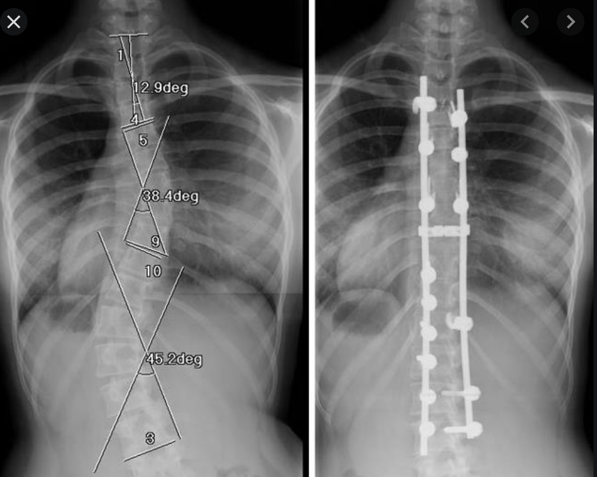

# Idiopatisk scoliose
Se mere generelt under [[Scoliose]].

## Generelt
	
Q. Hvordan opdeles [[Idiopatisk scoliose]] aldersmæssigt?
A. 0-5: Infantil, 5-10: Juvenil, > 10: Adolescent

Diverse årsager:
Q. Hvor stor sandsynlighed har en første-grads slægtning af en pt. med [[Idiopatisk scoliose]] for selv at få det?
A. 10%

## Differentialdiagnose

## Udredning
### Anamnese

### Objektiv us.

### Paraklinik

## Behandling
For vinkler, [[Cobbs vinkel]].

*Tidlig opsporing*
Q. Hvordan behandles [[Idiopatisk scoliose]]?
A. Hvis < 25 grader og stationær: Korset. Ellers operation.

Q. Hvorfor bruges korset ved [[Idiopatisk scoliose]]?
A. 1) Stopper progression, 2) Tillader monitorering til pt. er skeletmodnet

Q. Hvad kontraindicerer korset ved [[Adolescent idiopatisk scoliose]]?
A. 1) Været i pubertet i 2 år, knogler er modnet

Q. Hvilke faktorer indicerer operation ved [[Idiopatisk scoliose]]?
A. 1) Svære smerter, 2) Svær kosmetik, 3) Vinkel over 45 grader, 4) Nedsat organfunktion, 5) Koronal imbalance

Q. Hvad gøres under operationen for [[Idiopatisk scoliose]]? 
A. Resektion af interspinøse ligamenter, opmejsling af facetled, fiksering på langs vha. pedikelskruer.

## Opfølgning

## Prognose
 

## Backlinks
* [[Idiopatisk scoliose]]
	* Q. Hvordan opdeles [[Idiopatisk scoliose]] aldersmæssigt?
	* Diverse årsager:
A. 10%
	* Q. Hvordan behandles [[Idiopatisk scoliose]]?
	* Q. Hvorfor bruges korset ved [[Idiopatisk scoliose]]?
	* Q. Hvilke faktorer indicerer operation ved [[Idiopatisk scoliose]]?
	* Q. Hvad gøres under operationen for [[Idiopatisk scoliose]]? 

* [[Scoliose]]
	* Funktionel skoliose
	Ischias
Strukturel skoliose
	Kongenitte
		\* Fejlsegmentering
		\* Syndrom
	[[Idiopatisk scoliose]]
	Neuro-muskulære
		\* Duchenne
		\* Charcot-marie tooth
	Intrauterint
		\* Virus, intrauterint etc.
	* For børn, se også [[Idiopatisk scoliose]].

<!-- #anki/tag/med/Orto #anki/deck/Medicine -->

<!-- {BearID:E03DC908-058C-47F9-A7F1-9892CCF15FC7-2650-00000531F8CD8297} -->
