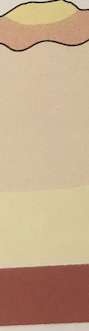
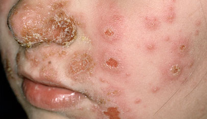

# Impetigo
Børnesår.

Q. Hvilken type infektion ses her?

A. [[Impetigo]]

Q. Hvad menes i dermatologi med *[[Impetigo]]*? 
A. *Overfladisk epidermal infektion*

Q. Hvad hedder en *overfladisk epidermal infektion* i derma? 
A. *[[Impetigo]]* 

Q. Hvad ses her?

A. [[Impetigo]]

Q. Hvad er morfologien ved [[Impetigo]]?
A. Typisk rødme med sår og skorpe.

Q. Beskriv *S* OCRATES for Impetigo 
A. Ansigt, øreflipper, nasolabialfurer, truncus

Q. Beskriv S *O* CRATES for Impetigo 
A. Over dage

Q. Beskriv SO *C* RATES for Impetigo 
A. Rødt og skorpende

Q. Beskriv SOCR *A* TES for Impetigo 
A. Kløe

Q. Hvordan behandles [[Impetigo]]? 
A. Mild og lokal) Klorhexidin 1%. Mere udbredt) Systemisk [[Dicloxacillin]].

Q. Din patient har mild [[Impetigo]]. Der bliver foreslået lokal AB som behandling. Hvad nu?
A. Undgå! Stor risiko for resistens-udvikling.

Q. En 6-årig igangsættes med relevant behandling for [[Impetigo]]. Hvad skal de, udover bivirkninger, informeres om?
A. 1) Færdiggør hele kuren, 2) Hold barnet hjemme *indtil skorper faldet af*, 3) Tøjvask ved mindst 80 grader

## Backlinks
* [[Impetigo]]
	* Q. Hvilken type infektion ses her?
A. [[Impetigo]]
	* Q. Hvad menes i dermatologi med *[[Impetigo]]*? 
	* Q. Hvad hedder en *overfladisk epidermal infektion* i derma? 
	* Q. Hvad ses her?
A. [[Impetigo]]
	* Q. Hvad er morfologien ved [[Impetigo]]?
	* Q. Hvordan behandles [[Impetigo]]? 
	* Q. Din patient har mild [[Impetigo]]. Der bliver foreslået lokal AB som behandling. Hvad nu?
	* Q. En 6-årig igangsættes med relevant behandling for [[Impetigo]]. Hvad skal de, udover bivirkninger, informeres om?
* [[Follikulitis]]
	* Q. Du er i tvivl om din patient har [[Follikulitis]] eller en [[Furunkel]]. Hvorfor er det vigtigt at adskille? 
* [[Ektyma]]
	* Q. Hvordan behandles [[Ektyma]]?
* [[Børneinfektioner i huden]]
	* [[Impetigo]]
* [[Infektioner i huden]]
	* [[S. aureus]]
	[[SSSS]]
	[[Erysipelas]]
	[[Ektyma]]
	[[Follikulitis]]
		[[Furunkel]]
			[[Karbunkel]]
	[[Cellulitis]]
	[[Nekrotiserende fasciitis]]

<!-- #anki/tag/med/Derma #anki/deck/Medicine #anki/tag/med/Infectious -->

<!-- {BearID:F34D6656-863B-45B7-B7AF-EC11F8DCA8F8-43570-0000512426995468} -->
