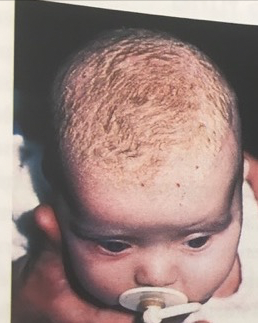

# Infantil seboroisk dermatitis
Q. Hvad ses her?

A. [[Infantil seboroisk dermatitis]]

Q. Hvilke symptomer ses typisk ved [[Infantil seboroisk dermatitis]]?
A. Ingen

Q. Hvor ses især [[Infantil seboroisk dermatitis]]?
Q. Hårbund, ansigt, bryst og hudfolder (bleområde)

Q. Hvordan behandles arpen ved [[Infantil seboroisk dermatitis]]?
A. Opløses i olie og kæmmes væk

Q. Hvordan behandles hudforandringerne ved [[Infantil seboroisk dermatitis]]?
A. 1) Fedtet fugtighedscreme, i svære tilfælde 2) Steroidcreme

## Backlinks
* [[Infantil seboroisk dermatitis]]
	* Q. Hvad ses her?
A. [[Infantil seboroisk dermatitis]]
	* Q. Hvilke symptomer ses typisk ved [[Infantil seboroisk dermatitis]]?
	* Q. Hvor ses især [[Infantil seboroisk dermatitis]]?
	* Q. Hvordan behandles arpen ved [[Infantil seboroisk dermatitis]]?
	* Q. Hvordan behandles hudforandringerne ved [[Infantil seboroisk dermatitis]]?
* [[Seboroisk dermatitis]]
	* [[Infantil seboroisk dermatitis]]

<!-- #anki/tag/med/Derma #anki/deck/Medicine #anki/tag/med/Pediatrics #anki/tag/med/GP -->

<!-- {BearID:025D8B66-E918-400A-B580-25EF227C84ED-43570-00004DC1DEBC9320} -->
