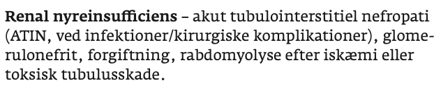

# Intrarenalt nyresvigt
## Generelt

## Differentialdiagnose

## Udredning
### Anamnese

### Objektiv us.

### Paraklinik

## Behandling

## Opfølgning

## Prognose
 

## Backlinks
* [[Akut nyresvigt (AKI)]]
	* [[Prærenalt nyresvigt]]
[[Postrenalt nyresvigt]]

<!-- #anki/deck/Medicine# #anki/tag/med/Nephrology -->

<!-- {BearID:247FFE9D-11B3-410E-B50D-338691AAC723-15714-000035C7A9A5158B} -->
