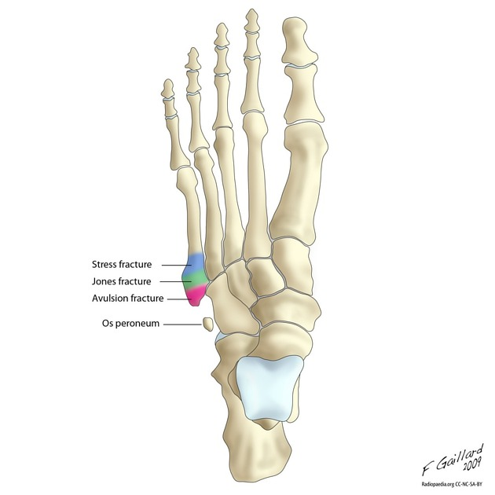

# Jones fraktur
## Generelt
Q. Hvad menes i sundhedsvæsenet med *[[Jones fraktur]]*? 
A. *Fraktur basalt på 5. metatars*

Q. Hvad hedder *fraktur basalt på 5. metatars* i sundhedsvæsenet? 
A. *[[Jones fraktur]]* 

## Differentialdiagnose

## Udredning
### Anamnese

### Objektiv us.
Ømhed ved 1. metatars, noget af det man undersøger for ved [[Ankeltraume]].

### Paraklinik

## Behandling
Q. Hvordan behandles en [[Jones fraktur]]?
A. Behandles med gips i op til 10 uger pga. delvist afbrudt blodforsyning.

I modsætning til avulsionsfrakturen, som bare aflastes et par uger.

## Opfølgning
Har tendens til at udvikle pseudoartrose. Hvis stadig symptomer efter 6 måneder stilles diagnosen, og der opereres med oprensning og skrue.

## Prognose

## Backlinks
* [[Jones fraktur]]
	* Q. Hvad menes i sundhedsvæsenet med *[[Jones fraktur]]*? 
	* Q. Hvad hedder *fraktur basalt på 5. metatars* i sundhedsvæsenet? 
	* Q. Hvordan behandles en [[Jones fraktur]]?
* [[Ankeltraume]]
	* OBS [[Malleolfraktur]], [[Jones fraktur]], [[Ankelligamentlæsioner]], [[Ankelsenelæsioner]]
* [[§Ankel]]
	* [[Ankeltraume]]
	[[Ankelsenelæsioner]]
	[[Ankelfrakturer]]
		[[Malleolfraktur]]
		[[Jones fraktur]]
* [[Metatarsfraktur]]
	* [[Jones fraktur]]

<!-- #anki/tag/med/Orto #anki/deck/Medicine -->

<!-- {BearID:405EE427-4646-4B79-9009-1CA5E4BC44A7-97624-0000BD3462915DA0} -->
