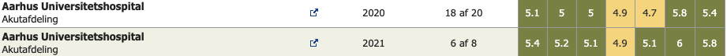
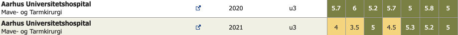
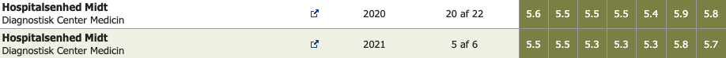
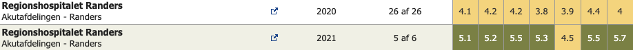
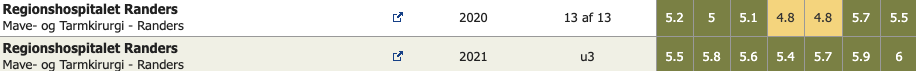
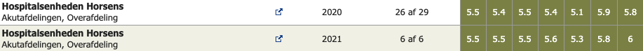
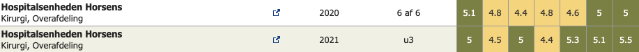
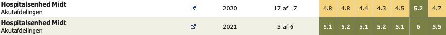

# KBU tips
Evaluer.dk
Uddannelsesprogrammer, videreuddannelse nord
Lægefaglig indstilling - antal stillinger i specialerne

[LægeLøn](https://xn--lgeln-sra3k.dk/)

*Hospitaler (transporttid bil med ankomst 7:45)*:
*AUH (15)*

*Silkeborg (0:30-0:50)*

*Randers (0:30-0:50)*

*Horsens (0:40-1:05)*

*Herning/Gødstrup (1:00-1:30)*

*Viborg (1:00-1:20)*

<!-- {BearID:04D77E31-92B6-4A31-8B45-7B595CC02D19-1827-000004F64B7B8086} -->
