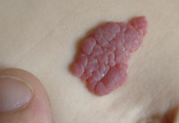

# Kapillært hæmangiom (storkebid)
## Generelt
Kapillære hæmangiomer (superficielle hæmangiomer/storkebid) er normale. Kan ses forskellige steder:
1. Skalp
2. Øvre øjenlåg
3. Nakke

## Differentialdiagnose
Hvis det har en hurtig vækstfase (pludseligt), OBS [[Kavernøst hæmangiom]].

## Udredning
### Anamnese

### Objektiv us.
Q. Hvad ses her?

A. [[Kapillært hæmangiom (storkebid)]]

### Paraklinik

## Behandling

## Opfølgning

## Prognose
Forsvinder typisk inden 3-årsalderen.

Dem på øvre øjenlåg falmer indenfor 1. leveår.

## Backlinks
* [[Kapillært hæmangiom (storkebid)]]
	* Q. Hvad ses her?
A. [[Kapillært hæmangiom (storkebid)]]
* [[Naevus flammeus (portvinsmærke)]]
	* Q. Hvordan adskilles [[Naevus flammeus (portvinsmærke)]] fra [[Kapillært hæmangiom (storkebid)]]?
* [[Infantilt hæmangiom]]
	* [[Kavernøst hæmangiom]]
[[Naevus flammeus (portvinsmærke)]]
	* Q. Hvilke typer [[Infantilt hæmangiom]] findes der?

<!-- #anki/tag/med/Derma #anki/deck/Medicine #anki/tag/med/GP# #anki/tag/med/Pediatrics -->

<!-- {BearID:DAED0D09-2D14-4131-81DC-C5DE52AAB1DA-62499-00007E4DEDDE41BE} -->
