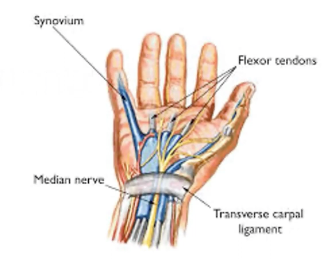
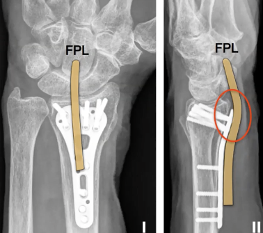
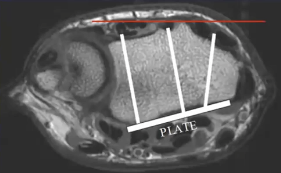

# Karpaltunnelsyndrom
## Generelt
En lidelse i [[§Håndled]].

Q. Hvad sker der anatomisk ved karpaltunnelsyndrom?
A. N. medianus afklemmes i karpaltunnellen

Q. Hvordan afgrænses karpaltunellen?
A. Carpalknoglerne og lig. carpi transversum

Q. Hvilke anatomiske årsager er der til karpaltunnelsyndrom?
A. 1) Fortykkelse af lig. carpi transversum eller 2) Synovit/tendinit med ødem

Q. Hvilke personer har især risiko for [[Karpaltunnelsyndrom]]?
A. Midaldrende kvinder og gravide

## Differentialdiagnose

## Udredning
### Anamnese
Q. Hvad er symptomerne på karpaltunnelsyndrom?
A. S: Natlige smerter og paræstesier i 2., 3. og 4. finger., A: Fummelfingret og nedsat kraft

### Objektiv us.
Q. Hvilke kliniske tests findes for karpaltunnelsyndrom?
A. [[Phalens test]], [[Tinnels test]]

Q. Din patient viser symptomer på [[Karpaltunnelsyndrom]]. Hvad vil du tilføje *den objektive us.*? 
A. 1) Inspektion, 2) Palpation for smerter og hævelse, 3) Funktion: Aktiv/passiv bevægelighed, kraft, reflekser, tests: [[Phalens test]], [[Tinnels test]], [[Allens test]]

Q. Hvorfor udføres [[Allens test]] ved OBS [[Karpaltunnelsyndrom]]?
A. Udelukke vaskulær årsag

### Paraklinik
Q. Hvordan kan man paraklinisk undersøge for karpaltunnelsyndrom?
A. ENG

Q. Din patient viser symptomer på [[Karpaltunnelsyndrom]]. Hvad vil du tilføje til *paraklinikken*? 
A. ENG

## Behandling
Q. Hvordan behandles karpaltunnelsyndrom? 
A. 1) Tidligt (ingen atrofi eller sensoriske udfald): Håndledsskinne, 2) Forsøg steroidinjektion, 3
) Gennemskæring af lig. carpi transversum

Bruger sjældent kortisoninjektion i DK pga. risiko fro demyelinering.

## Opfølgning

## Prognose
Q. Hvor hurtigt vil forventes fuld effekt af operation for [[Karpaltunnelsyndrom]]?
A. Uger

## Backlinks
* [[Distal radius-fraktur]]
	* Q. Hvad er specielle komplikationer til en volarskinne for en [[Distal radius-fraktur]]?

* [[Karpaltunnelsyndrom]]
	* Q. Hvilke personer har især risiko for [[Karpaltunnelsyndrom]]?
	* Q. Din patient viser symptomer på [[Karpaltunnelsyndrom]]. Hvad vil du tilføje *den objektive us.*? 
	* Q. Hvorfor udføres [[Allens test]] ved OBS [[Karpaltunnelsyndrom]]?
	* Q. Din patient viser symptomer på [[Karpaltunnelsyndrom]]. Hvad vil du tilføje til *paraklinikken*? 
	* Q. Hvor hurtigt vil forventes fuld effekt af operation for [[Karpaltunnelsyndrom]]?
* [[§Håndled]]
	* [[Karpaltunnelsyndrom]]
* [[Kompressionsneuropatier]]
	* Kendt som tunnelsyndromer, hvor den hyppigste er [[Karpaltunnelsyndrom]].

<!-- #anki/tag/med/Orto #anki/deck/Medicine -->

<!-- {BearID:B9629629-C7A5-4984-A8B9-C05143A7947C-15088-0000D703E78FDADD} -->
