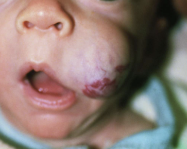

# Kavernøst hæmangiom
Kavernøse hæmangiomer ses typisk i børn.

O
   Ikke medfødt, opstår i første levemåned

T
   Gradvist voksende indtil 3-15 mdr.

Diagnosticeres på klinik. Ved usikkerhed biopsi pga. risiko for sarkom.

Behandling indiceret hvis:
1. Påvirket syn
2. Påvirket luftvej
3. Betydelig ulceration
4. Thrombocytopeni

Behandles med:
1. Propranolol
2. Laserbehandling
3. Steroid

Kan suppleres med kirurgi.

Ved mere end 5 skal der udredes for ekstrakutane hæmangiomer.

Q. Hvad ses her?

A. [[Kavernøst hæmangiom]]

## Backlinks
* [[Kavernøst hæmangiom]]
	* Q. Hvad ses her?
A. [[Kavernøst hæmangiom]]
* [[Kapillært hæmangiom (storkebid)]]
	* Hvis det har en hurtig vækstfase (pludseligt), OBS [[Kavernøst hæmangiom]].
* [[Naevus flammeus (portvinsmærke)]]
	* Hvis det har en hurtig vækstfase (pludseligt) , eller har lidt "fylde", [[Kavernøst hæmangiom]].
* [[Infantilt hæmangiom]]
	* [[Kavernøst hæmangiom]]
[[Naevus flammeus (portvinsmærke)]]
	* Q. Hvilke typer [[Infantilt hæmangiom]] findes der?
	* Q. Hvordan adskilles de forskellige typer [[Infantilt hæmangiom]]?

<!-- #anki/tag/med/Derma #anki/deck/Medicine #anki/tag/med/GP# #anki/tag/med/Pediatrics -->
t

<!-- {BearID:164C29AB-4A8B-4E4F-BF8F-EFF7CDF49EF1-62499-00007E4F38FE25A0} -->
