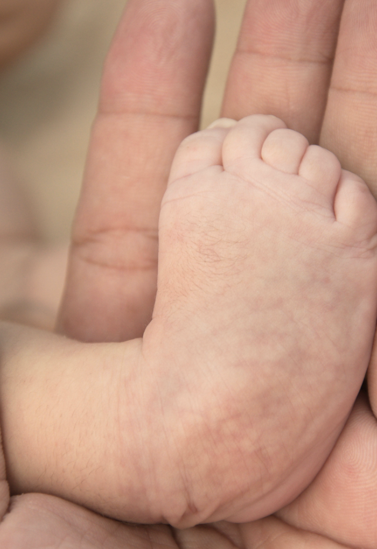

# Klumpfod
Pes equino varus et adductus, talipes equinovarus, clubfoot

Q. Hvordan beskrives klumpfod anatomisk (varus, valgus, adduktion, abduktion etc.)?
A. Varus i bagfod, adduktion og pronation af mellemfod

Q. Hvordan adskilles klumpfod fra [[Positionel talipes]]?
A. Klumpfod kan ikke manipuleres til neutralstilling

Q. Hvordan diagnosticeres klumpfod?
A. Klinik (+ rtg.)

Q. Et nyfødt barn har fået diagnosticeret klumpfod. Hvad skal igangsættes inden udskrivelse?
A. 1) Behandling (kirurgisk/gips), 2) Udredning for [[Hoftedysplasi]].

Q. Hvordan behandles klumpfod?
A. 1) Initielt serie-gips (+ overskæring af achillessenen i lokal, når nødvendig), 2) sko og skinner 24/7 i 3 mdr., 3) dernæst natligt til barnet er 5 år.

Q. Hvordan behandles recidiv af klumpfod?
A. Serie-gips og/eller operation

Q. Hvor mange pt. får recidiv efter behandling af klumpfod?
A. Ca. 20%

<!-- #anki/tag/med/Orto #anki/deck/Medicine #anki/tag/med/Pediatrics -->

<!-- {BearID:0E525416-3F84-4F96-8DD5-89B72CC8ED99-71605-0000A3C3C50A0C76} -->
