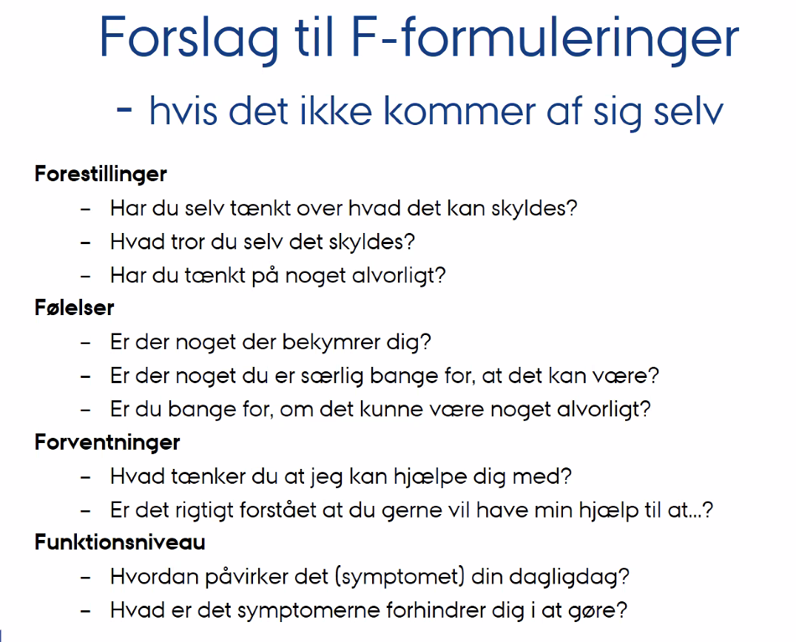

# Kommunikation
Q. Hvad betyder de 4 F’er?
A. 1) Forestillinger, 2) Forventninger, 3) Følelser og 4) Funktionsevne

[[Den svære samtale]]

<!-- #anki/tag/med/gp #anki/deck/Medicine #anki/tag/med/Communication -->

<!-- {BearID:D516F150-79F4-4595-BF26-DCBA6DD640EB-21842-000031AD9B3DB490} -->
