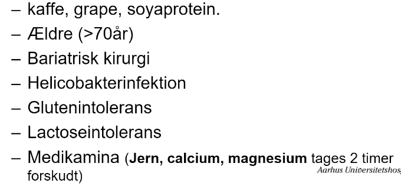

# LT4 (Levothyroxin)
[[Levothyroxin]].

## Generelt
Q. Du skal starte din pt. i [[LT4 (Levothyroxin)]]. Hvad vil du være OBS på?
A. 1) Hvis hjertesygdom, start ved lavere dosis. 2) Indtages mindst 30 min før mad og 2 timer før jern, calcium, magnesium.

Har nedsat absorption ved en række tilstande:

<!-- #anki/tag/med/Endocrinology #anki/deck/Medicine -->

## Backlinks
* [[Thyrotoxikose]]
	* Q. Hvad menes med block-replacement therapy?
* [[LT4 (Levothyroxin)]]
	* Q. Du skal starte din pt. i [[LT4 (Levothyroxin)]]. Hvad vil du være OBS på?
* [[Subakut thyroiditis]]
	* Q. Hvad er behandling af subakut thyroiditis i den hypothyreotiske fase?

<!-- {BearID:B957601A-E89C-431F-991E-B4988B243D92-31003-0000760254634B7D} -->
