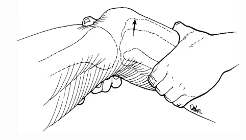

# Lachmans test
Q. Hvad menes i sundhedsvæsenet med *[[Lachmans test]]*? 
A. *Træk i tibia ved 20 graders fleksion med fiksering af fibula for at teste ACL*

Q. Hvad hedder *træk i tibia ved 20 graders fleksion med fiksering af fibula for at teste ACL* i sundhedsvæsenet? 
A. *[[Lachmans test]]* 

Q. Beskriv en [[Lachmans test]]
A. I 20 grader.

## Backlinks
* [[Lachmans test]]
	* Q. Hvad menes i sundhedsvæsenet med *[[Lachmans test]]*? 
	* Q. Hvad hedder *træk i tibia ved 20 graders fleksion med fiksering af fibula for at teste ACL* i sundhedsvæsenet? 
	* Q. Beskriv en [[Lachmans test]]

* [[Undersøgelse af knæ]]
	* [[Lachmans test]] – grundlæggende anterior skuffetest ved kun 20 graders fleksion
* [[Anterior korsbåndslæsion (ACL-læsion)]]
	* Q. Din patient viser symptomer på [[Anterior korsbåndslæsion (ACL-læsion)]]. Hvad vil du tilføje *den objektive us.*? 
* [[Us. af knæ]]
	* *Stabilitet*: Ingen sideløshed ved MCL eller LCL strakt eller ved fleksion til 20 grader. Negativ [[Lachmans test]], [[Pivot shift test]] og [[Anterior skuffetest i knæ]].

<!-- #anki/deck/Medicine #anki/tag/med/Orto -->

<!-- {BearID:07B58958-411B-4255-B433-F031B8EF487F-86299-00012E86B04B8B04} -->
