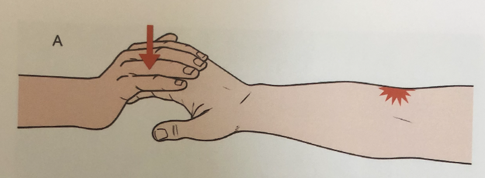

# Lateral epicondylitis
## Generelt
Q. Hvad hedder *[[Lateral epicondylitis]]* i daglig tale? 
A. *Tennisalbue*

Q. Hvad hedder *Tennisalbue* i sundhedsvæsenet? 
A. *[[Lateral epicondylitis]]* 

## Differentialdiagnose
[[Radialtunnelsyndrom]]
[[§Artrose]]
Traume

## Udredning
### Anamnese

### Objektiv us.

### Paraklinik

## Behandling
Q. Hvordan behandles [[Lateral epicondylitis]]?
A. 1) [[NSAID]], 2) Steroidblokade og fysioterapi, 3) Kirurgi med overskæring af tilhæftet

## Opfølgning

## Prognose
85% bedres spontant indenfor 2 år.

## Backlinks
* [[§Albue]]
	* [[Lateral epicondylitis]]
* [[Lateral epicondylitis]]
	* Q. Hvad hedder *[[Lateral epicondylitis]]* i daglig tale? 
	* Q. Hvad hedder *Tennisalbue* i sundhedsvæsenet? 
	* Q. Hvordan behandles [[Lateral epicondylitis]]?
* [[Medial epicondylitis]]
	* Langt mindre generende end [[Lateral epicondylitis]], behandles med NSAID-gel. 

<!-- #anki/tag/med/Orto #anki/deck/Medicine #anki/tag/med/GP -->

<!-- {BearID:4390C642-CE8B-4049-A666-C9BF24F683EF-53319-000070C694876BE7} -->
