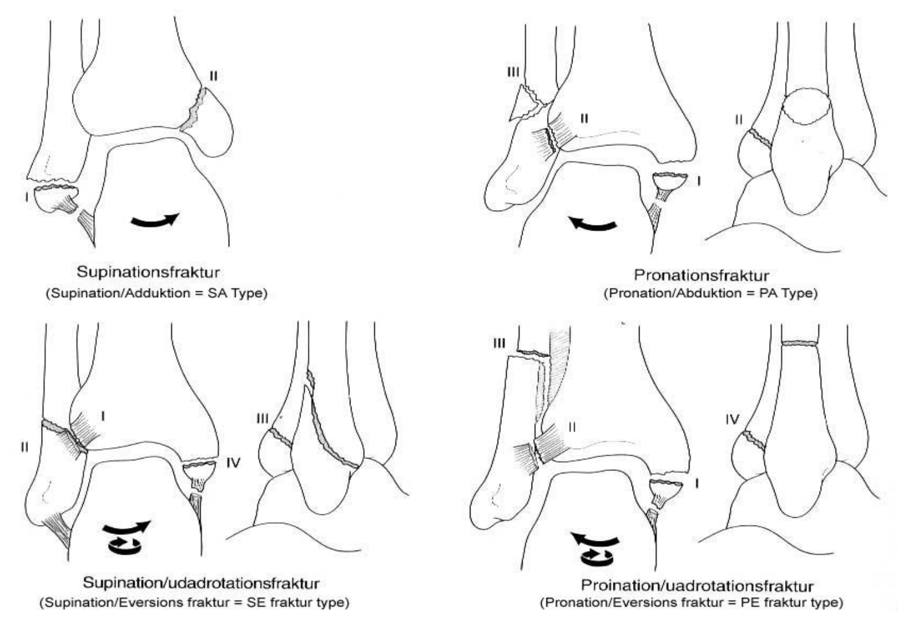

# Lauge-Hansen klassifikationen
Udadrotation er Udadrotation af foden.

OBS: Rotationspilen matcher at foden peger ud af  billedet.

_Supinationsfraktur:_
* Stadie I: Supinationsfraktur, Afrivningsfraktur i laterale malleol, eller evt. overrivning i kollaterale ligamenter.* Stadie II: Saggital fraktur i mediale malleol

_Pronationsfraktur:_
* Stadie I: Afrivningsfraktur i mediale malleol eller overrivning af ligamentum deltoideum. 
* Stadie II: Ruptur af forreste eller bagerste tibiofibulære ligament, evt. afrivningsfraktur ved ligamentinsertionen på tibia. 
* Stadie III: Kort fraktur 1-2 cm over talokruralleddet

_Supination/udadrotation: (hyppigste)_
* Stadie I: Læsion af det forreste tibiofibulære ligament eller afrivning ved hæfte på tibia.
* Stadie II: Spiralfraktur i distale fibula.
* Stadie III: Fraktur i margo posterior eller ruptur af ligmanetinsertionen dér. 
* Stadie IV: Fraktur af mediale malleol eller ligmanetum deltoideus. 

_Pronation/udadrotation:_
* Stadie I: Afrivning af mediale malleol eller læsion i ligamentum deltoideum. 
* Stadie II: Ruptur i forreste tibiofibulære ligament og syndesmosen. 
* Stadie III: Transversel eller spiralformet fraktur proksimalt i fibuladiafysen.
* Stadie IV: Fraktur i margo posterior tibia eller overrivning af bagre talofibulare ligament. 

## Backlinks
* [[Ankeltraume]]
	* [[Lauge-Hansen klassifikationen]]

<!-- #anki/tag/med/Orto #anki/deck/Medicine -->

<!-- {BearID:84C33B90-0066-4931-AD1E-998EB8E83D93-1507-000007B8EA236672} -->
