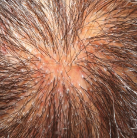
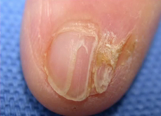

# Lichen planus
## Generelt
Hyppigst i 30-60 års alderen

## Differentialdiagnose

## Udredning
### Anamnese

### Objektiv us.
Q. Beskriv – Diagnose(r)?

A. Dukkehår - [[Lichen planus]]

Q. Beskriv – Diagnose(r)?

A. Degeneration af negle - [[Lichen planus]]

### Paraklinik

## Behandling

## Opfølgning

## Prognose

<!-- #anki/deck/Medicine #anki/tag/med/Derma -->

## Backlinks
* [[Lichen planus]]
	* Q. Beskriv – Diagnose(r)?
A. Dukkehår - [[Lichen planus]]
	* Q. Beskriv – Diagnose(r)?
A. Degeneration af negle - [[Lichen planus]]
* [[Psoriasis]]
	* Q. Hvordan adskilles [[Nummulat psoriasis vulgaris]] fra [[Lichen planus]]?
	* Q. Hvordan adskilles [[Nummulat psoriasis vulgaris]] fra [[Lichen planus]]?
* [[Köbners fænomen]]
	* Q. Hvilke hudsygdomme viser [[Köbners fænomen]]?
* [[Balanopostitis]]
	* [[Lichen planus]]
* [[Nummulat dermatitis]]
	* Q. Hvilke differentialdiagnoser er der til [[Nummulat dermatitis]]?
* [[Lichen ruber (brug Lichen planus)]]
	* Synonym med [[Lichen planus]].

<!-- {BearID:A6EC3AD4-BF5C-4404-8E9E-E62CE58CF0D9-959-000007922C628A70} -->
