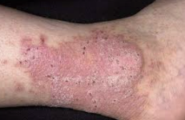

# Lichen simplex chronicus
Kaldes også neurodermatitis.

Q. Hvad ses her?

A. [[Lichen simplex chronicus]]

Q. Hvad menes i dermatologi med *[[Lichen simplex chronicus]]*? 
A. *Kløe i et let skællende område*

Q. Hvad hedder *kløe i et let skællende område* i derma? 
A. *[[Lichen simplex chronicus]]* 

Q. Hvordan behandles [[Lichen simplex chronicus]]?
A. 1) Okkluderende forbinding og 2) Lokalt steroid

Okkluderende forbinding hjælper på symptomer og beskytter mod krads.

## Backlinks
* [[Lichen simplex chronicus]]
	* Q. Hvad ses her?
A. [[Lichen simplex chronicus]]
	* Q. Hvad menes i dermatologi med *[[Lichen simplex chronicus]]*? 
	* Q. Hvad hedder *kløe i et let skællende område* i derma? 
	* Q. Hvordan behandles [[Lichen simplex chronicus]]?
* [[Dermatitis]]
	* [[Eczema craquelee]]
[[Lichen simplex chronicus]]
	[[Perianal dermatitis]]

<!-- #anki/tag/med/Derma #anki/deck/Medicine -->

<!-- {BearID:4C194CCB-4CE9-4D6B-AE5B-8DAAE3075396-43570-00004BECBEC7EC07} -->
