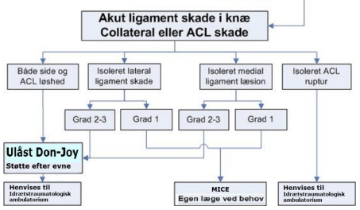

# Ligamentskade i knæ
## Generelt

## Differentialdiagnose

## Udredning
### Anamnese

### Objektiv us.

### Paraklinik

## Behandling

## Opfølgning

## Prognose
 

## Backlinks
* [[§Knæet]]
	* [[Knætraume]]
	[[Ligamentskade i knæ]]t
		[[Anterior korsbåndslæsion (ACL-læsion)]]
		[[Posterior korsbåndslæsion (PCL-læsion)]]
		[[MCL-læsion]]
		[[LCL-læsion]]
	
	[[Popliteussene-læsion]]
	[[Posterior oblique ligament-læsion]]

<!-- #anki/tag/med/Orto #anki/deck/Medicine -->

<!-- {BearID:56277AF8-F317-4740-AFC3-A720D78E7D6D-7035-000021D20988715B} -->
