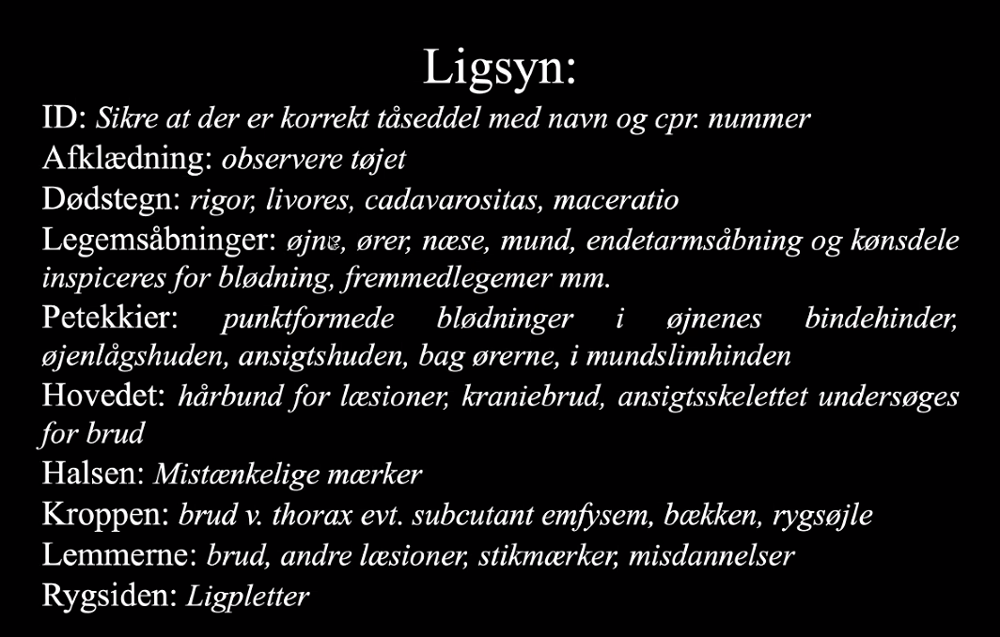
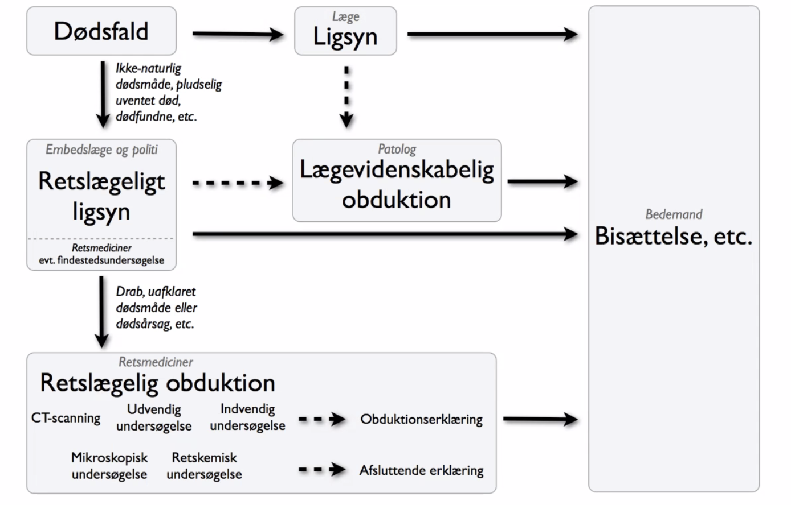

# Ligsyn
11/03/2021

Video på BB af ligsynet.

Der skal grundlæggende kontakt til politiet, hvis dødsmåden ikke er naturlig.

Dødsattest.

Dødsmåde, naturlig eller unaturlig.

[[Dødsattest]]

### Information til pårørende

## Backlinks
* [[Dødsformodning]]
	* Dernæst intervalstuen. Når sikre dødstegn, [[Ligsyn]], og så [[Kapel]].
* [[Dødsfald på hospital]]
	* [[Dødsformodning]]

<!-- #anki/tag/med/Forensic Medicine# #anki/deck/Medicine -->

<!-- {BearID:ECFE11E0-0260-4297-A6ED-3B46BD23784E-51703-000058B22972F37C} -->
