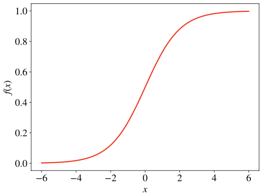

# Logistic regression
Q. 

What is the name of this function?
A. The sigmoid function

Q. 

Why is this function helpful in logistic regression?
A. Its codomain is between 0 and 1

Q. What is the optimisation criterion for logistic regression?
A. The maximum likelihood

Q. For a single observation, what does “maximum likelihood” mean in maths?
A. A match between predicted class and actual class.

For more, see “The Hundred-Page Machine Learning Book”, 3.2.2.

## Backlinks
* [[§Machine Learning]]
	* [[Logistic regression]]

<!-- #anki/deck/ML -->

<!-- {BearID:824902B6-E47B-49AB-A491-AAC147FF491D-2200-00000ABC7CAFD122} -->
