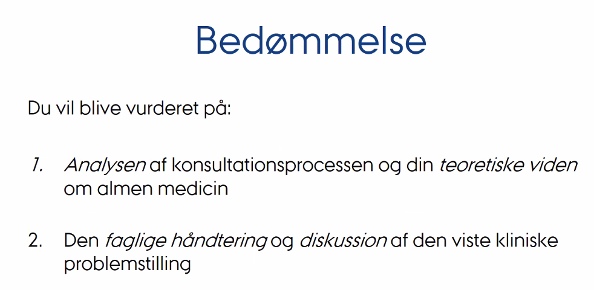
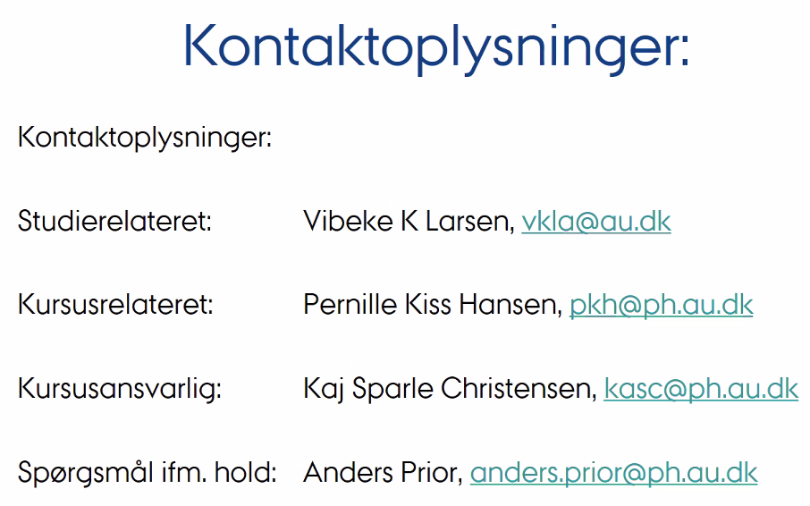
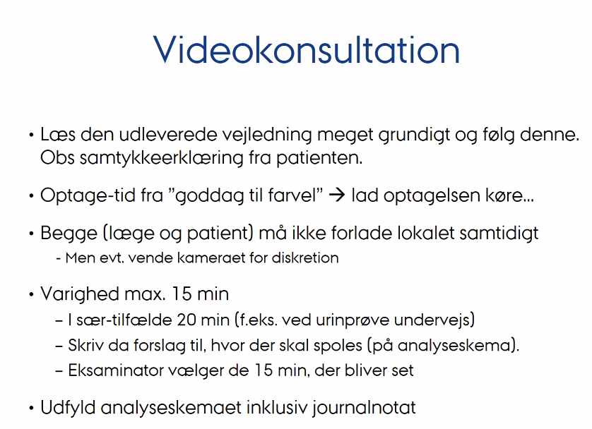

# Lone Borre, Lægerne Gjern
<!-- #anki/tag/med/GP -->

- Ankomst *8.05*

[Google Maps](https://www.google.dk/maps/dir/56.1562994,10.1830395/L%C3%A6gehuset+Gjern,+S%C3%B8ndergade,+Gjern/@56.1569456,10.1737235,14.67z/am=t/data=!4m13!4m12!1m0!1m5!1m1!1s0x464c0b0741abefad:0x173357870638edd!2m2!1d9.7410361!2d56.2218517!2m3!6e1!7e2!8j1615796100!3e3)

Behøver ikke corona-test.

Lones nr: 40 98 13 32 

* Hvordan plejer I at have studerende?
* Hvordan udvælges patienterne?
* Se patienter og journalnotater rent formelt
* Hvordan med supervision af notat/patient?
* Hvordan organiseres årskontroller?

2 videoer til fredag.
	Medbragte videoer kan ikke bruges til eksamen.
	

PSOAP: Problem, subjektivt, objektivt, analyse, plan

*Se screenshots fra forelæsning*

PSOAP: 
P: 22 årig kvinde, uønsket graviditet, GA 8+0. S: Para 0+0. O: U-hCG positiv. GU ia., chlamydia og GK podet. A: Kandidat til provokeret abort. P: Henvises til gyn, samtale om prævention 1 md. efter abort.

<!-- {BearID:C26A565C-03EB-4070-9E45-39D967BE03F9-21842-0000406C9265F369} -->
