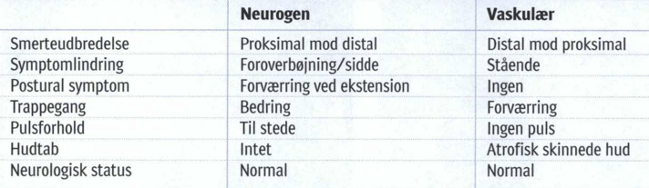
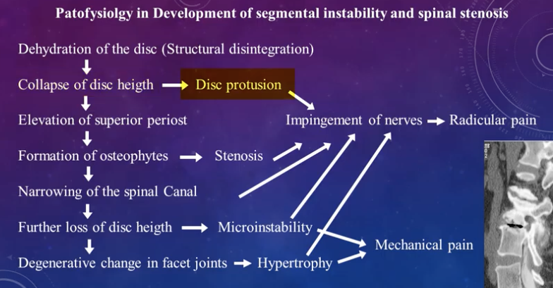
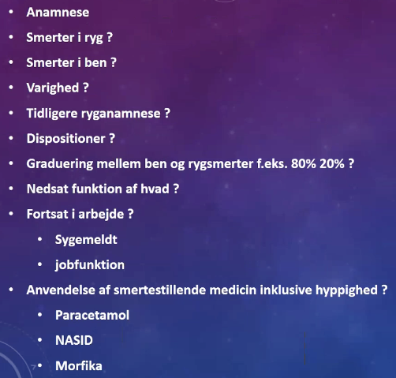
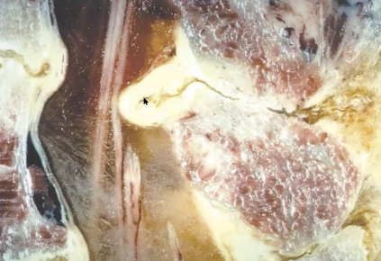
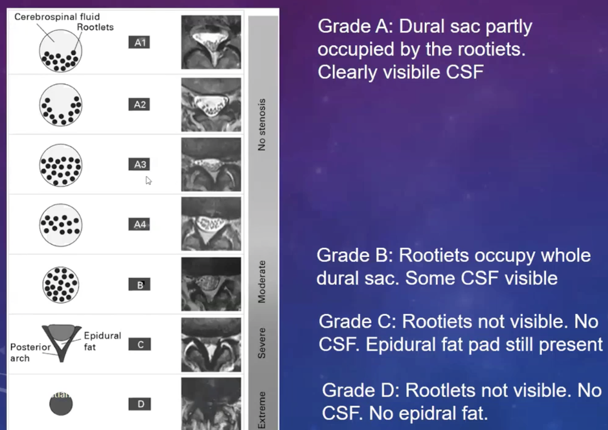

# Lumbal spinalstenose
## Generelt
Kan give symptombillede der hedder [[Neurogen claudicatio]].

## Differentialdiagnose
Årsager.
*Akut:*
	* Fraktur
	* Tumor/metastase
	* Abscess
	* Blødning

*Kronisk:*
	Degenerativ
		* [[Spondylolistese]]
		* [[Discusprolaps]]
		* [[Spondylose]]
	Idiopatisk
	Akondroplasi
	Akromegali

Ddx:
* [[Polyneuropati]]
	[[§Diabetes]]
	Ernæring (B12-mangel, alkoholisme)
* [[Vaskulær claudicatio]]
* Muskulære smerter
* Hofteartrose

Q. Hvad er de primære cancere der kan give knogleindvækst?
A. 1) Lunge, 2) Mamma, 3) Nyre, 4) Prostata, 5) Myelomatose

---

Q. Hvordan adskiller [[Lumbal spinalstenose]] sig symptomatisk/anamnestisk fra [[Lumbal diskusprolaps]]?
A. Spinalstenose har mere diffuse symptomer (ikke segment-specifikke) og nedsat gangdistance.

Q. Hvad er den kausale række for smerterne ved spinalstenose?
A. Dehydrering af disci -> Tab af discus-højde -> Trækker i corporas periost -> Osteofytdannelse -> Afsnævring af kanalen -> Degenerative forandringer i facetled

## Udredning
### Anamnese

Q. Beskriv *S* OCRATES for [[Lumbal spinalstenose]] 
A. Typisk bilateralt

Q. Beskriv SO *C* RATES for [[Lumbal spinalstenose]] 
A. Nedsat gangdistance, radierende smerter, i lavere grad lændesmerter. Neurologisk us. normal.

Q. Beskriv SOCR *A* TES for [[Lumbal spinalstenose]] 
A. Morgensmerter og stivhed

Q. Beskriv SOCRAT *E* S for [[Lumbal spinalstenose]] 
A. Bedres siddende eller foroverbøjet

Q. Hvorfor vil foroverbøjning hjælpe på [[Lumbal spinalstenose]]?
A. 1) Strækker ligg. flava ud, 2) Skaber bedre plads i formina intervertebrale

### Objektiv us.

### Paraklinik
Q. Hvilke billeder vil du have ef en [[Lumbal spinalstenose]]?
A. *Stående* rtg. + MR. Stående rtg. for at se efter [[Spondylolistese]] under belastning.

Q. Hvordan adskiller en grad A/B [[Lumbal spinalstenose]] sig fra en grad C eller D?
A. C og D kan man ikke se nerverødderne

Q. Hvordan adskiller en grad C [[Lumbal spinalstenose]] fra en grad D?
A. Grad D har ikke længere epidural fedtpode posteriort.

## Behandling
Q. Under hvilke omstændigheder skal [[Lumbal spinalstenose]] opereres?
A. 1) Svære symptomer + 2) Man ikke kan se de enkelte nervefibre på MR (Type C eller D).

Q. Hvad er behandlingen af [[Lumbal spinalstenose]]?
A. Dekompression (+ spondylodese (stivgøring))

## Opfølgning

## Prognose

## Backlinks
* [[Hofteartrose]]
	* Q. Hvilke traumatiske differentialdiagnoser findes til hofteartrose?
* [[Hoftedysplasi]]
	* DDX
	[[Lumbal spinalstenose]]
	[[Hofteartrose]]
	* Q. Hvor sidder smerterne typisk ved [[Hoftedysplasi]]?
* [[§Hofte]]
	* DDX hyppigt:
	[[Discusprolaps]]
* [[Lumbal spinalstenose]]
	* Q. Hvordan adskiller [[Lumbal spinalstenose]] sig symptomatisk/anamnestisk fra [[Lumbal diskusprolaps]]?
	* Q. Beskriv *S* OCRATES for [[Lumbal spinalstenose]] 
	* Q. Beskriv SO *C* RATES for [[Lumbal spinalstenose]] 
	* Q. Beskriv SOCR *A* TES for [[Lumbal spinalstenose]] 
	* Q. Beskriv SOCRAT *E* S for [[Lumbal spinalstenose]] 
	* Q. Hvorfor vil foroverbøjning hjælpe på [[Lumbal spinalstenose]]?

	* Q. Hvilke billeder vil du have ef en [[Lumbal spinalstenose]]?
	* Q. Hvordan adskiller en grad A/B [[Lumbal spinalstenose]] sig fra en grad C eller D?
	* Q. Hvordan adskiller en grad C [[Lumbal spinalstenose]] fra en grad D?

	* Q. Under hvilke omstændigheder skal [[Lumbal spinalstenose]] opereres?
	* Q. Hvad er behandlingen af [[Lumbal spinalstenose]]?
* [[§Ryggen]]
	* *Degenerative lidelser*
	\* [[Lumbal diskusprolaps]]
	\* [[Lumbal spinalstenose]]
	* Q. Hvilke degenerative lidelser findes i lænden?

<!-- #anki/tag/med/Orto #anki/deck/Medicine -->

<!-- {BearID:A87F68BB-3078-48F7-946E-559B3D7352F8-85278-00006711FFD2DB06} -->
