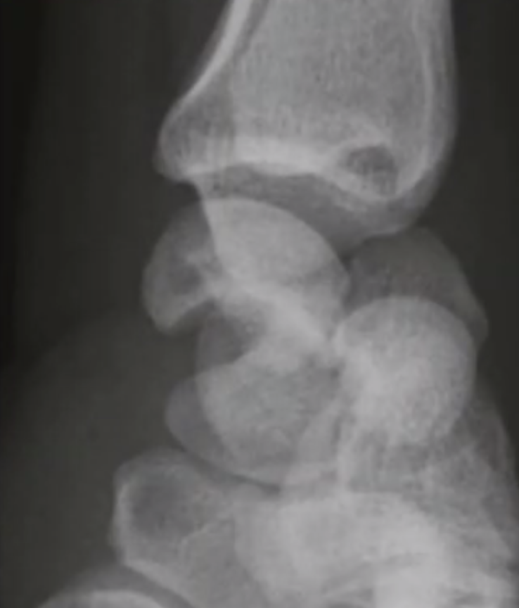

# Lunatum-dislokation
## Generelt

## Differentialdiagnose

## Udredning
### Anamnese
Q. Hvilke ting i anamnesen vil tyde på *[[Lunatum-dislokation]]*? 
A. 1) Voldsom dorsalflektion af håndleddet, 2) Efterfølgende paræstesier

### Objektiv us.

### Paraklinik
Q. Hvad ses her?

A. [[Lunatum-dislokation]]

*Udredes nærmest altid med CT.*

## Behandling

## Opfølgning

## Prognose
 

## Backlinks
* [[Lunatum-dislokation]]
	* Q. Hvilke ting i anamnesen vil tyde på *[[Lunatum-dislokation]]*? 
	* Q. Hvad ses her?
A. [[Lunatum-dislokation]]

* [[§Håndled]]
	* [[Lunatum-dislokation]]

<!-- #anki/tag/med/Orto #anki/deck/Medicine -->

<!-- {BearID:E9DE91C3-6081-4012-BE99-CB8D5845AC40-3348-0000043C14F5052C} -->
