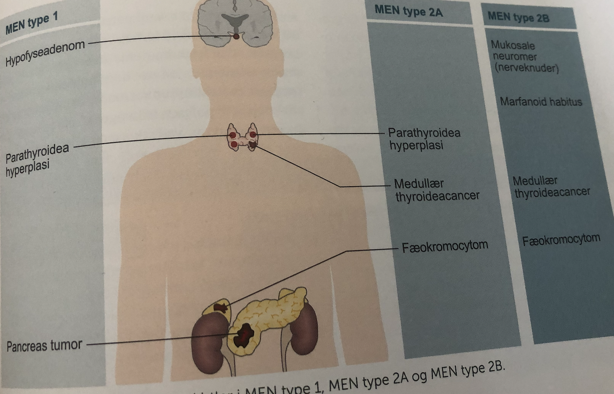

# MEN

[[MEN-1]]
[[MEN-2A]]
[[MEN-2B]]

Q. Hvordan nedarves MEN?
A. Autosomal *dominant* (tænk MEN are men, which are dominant)

Q. Hvilke tumores ses typisk ved [[MEN-1]]?
A. 1) [[Hypofyseadenom]], 2) [[Parathyroidea-hyperplasi (brug tertiær hyperparathyroidisme)]], 3) [[Pancreas-tumor]]

Q. Hvilke tumores ses typisk ved MEN-2?
A. 1) [[Medullært thyroideacarcinom]], 2) [[Fæokromocytom]]. (Tænk *T* for *2*)

<!-- #anki/tag/med/Endocrinology #anki/deck/Medicine #anki/tag/med/Oncology -->

<!-- {BearID:EE48717B-C062-49EA-A30E-59A1814D63EF-62757-00006E7028396D34} -->
