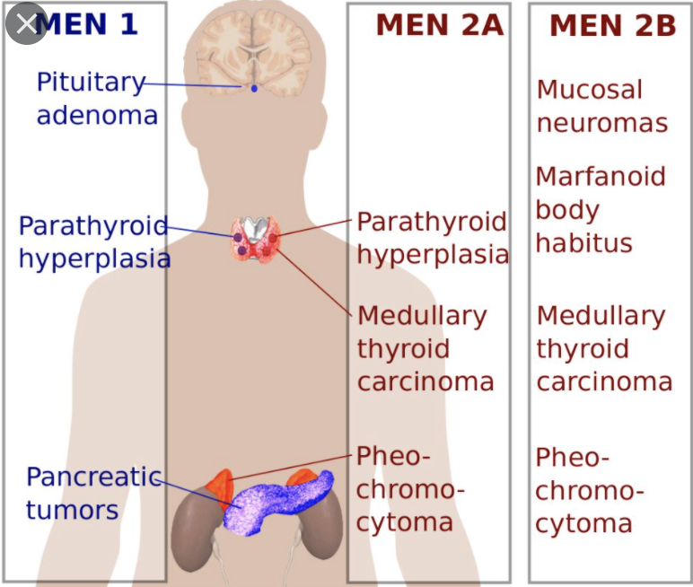

# MEN2B
## Generelt
Q. Din patient har [[MEN2A]]. Hvor har han øget risiko for tumores?
A. 1) Thyroidea, 2) Fæokromocytom, 3) Slimhinder (*T* for *2*)

## Differentialdiagnose

## Udredning
### Anamnese

### Objektiv us.

### Paraklinik

## Behandling

## Opfølgning

## Prognose

## Backlinks
* [[Multipel endokrin neoplasi (MEN)]]
	* [[MEN1]]
[[MEN2B]]

<!-- #anki/tag/med/Endocrinology #anki/deck/Medicine -->

<!-- {BearID:5C263B7A-0F90-482E-AD56-3DC67C7E324D-42831-0000759DE0052809} -->
