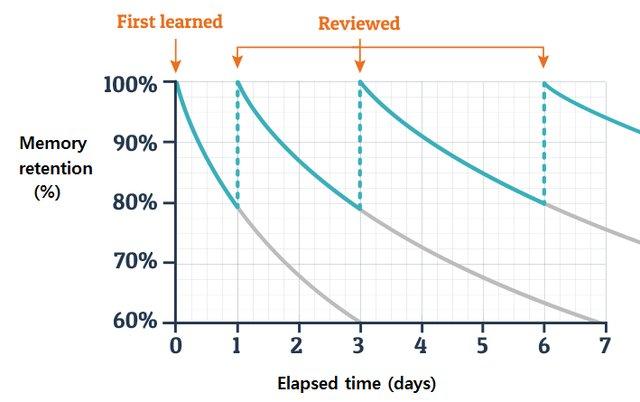

# ML PhD: Using Orbit for teaching
I think using it as a quick repetition at start of class is the most effective. The question then becomes: Is it helpful for epi or biostat?

Probably yes! I’ll run it by Bodil tomorrow. For that to happen, I need a short pitch:
1. Epi is about combining known facts and models to analyse something
2. But if you can’t remember definitions, you can’t understand models
3. The most efficient way of memorising is spaced repetition
	1. Ebbinghaus’ curve

4. We can integrate that into teaching via orbit
5. https://docs.withorbit.com/
6. I would like to teach epi this summer

<!-- {BearID:B000336B-1CAC-4D19-8B82-96D999E7850B-27523-0000257F34D720D8} -->
