# ML notation

<!-- #anki/tag/machine-learning -->
<!-- #anki/deck/ML -->

Q. What characterises a scalar?
A. It’s a numerical value, like 5

Q. How do we denote a single-letter scalar in ML?
A. Italicized letter, /a/

Q. What does /a/ denote in ML?
A. The scalar /a/

Q. What characterises a vector?
A. An ordered list of scalars

Q. What is a scalar called when it is a dimension of a vector?
A. An attribute

Q. How do we denote a single-letter vector in ML?
A. Bolded letter, *a*

Q. What does *a* denote in ML?
A. The vector *a*

Q. In which two ways can we visualise vectors?
A. Arrows or points
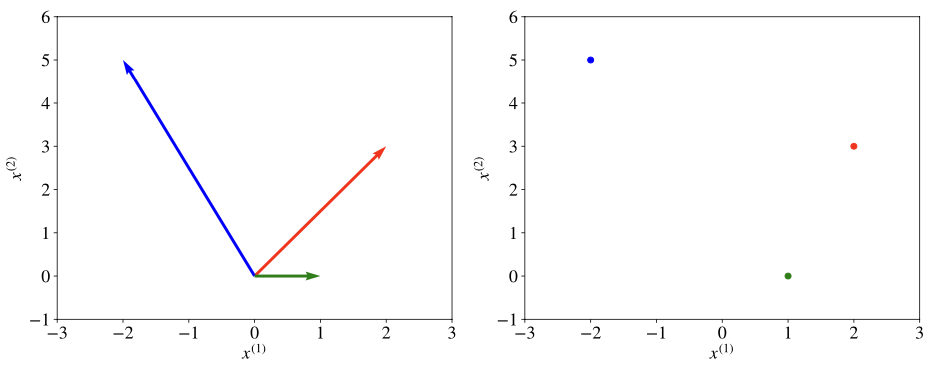

Q. How do we denote the 2nd attribute of vector *a*?
A. 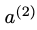

Q. How do we denote a matrix with letters?
A. *A* (capitalised and bolded)

Q. What does *A* denote in ML?
A. The matrix *A*

Q. What characterises a set?
A. An unordered collection of unique elements

Q. How do we denote a set with a letter?
A. Caligraphic capital character, like 

Q. What does  denote in ML?
A. The set S

Q. How do we denote a finite set in ML?
A. 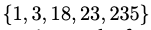

Q. 

In ML, what do these accolades mean?

A. The set is finite

Q. 
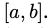
In ML, what do the brackets mean here?
A. The set is bounded by a and b *inclusive*.

Q. 
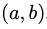
In ML, what do the parentheses mean here?
A. The set is bounded by a and b *non-inclusive*.

Q. 
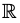
What are the bounds of this set?
A. -infinity to +infinity.

Q. 

What does this mean?
A. x belongs to the set S

Q. In math, how do we denote that x belongs to the set 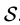?
A. 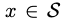

Q. How do we denote the intersection between set 1 and set 2?
A. 

Q.
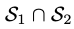
 What does this mean?
A. The intersection between set 1 and set 2.

Q. 

What is the results here?
A. {1, 8}

Q. How do we denote the union of set 1 and set 2?
A. 

Q.
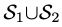
 What does this mean?
A. The union of set 1 and set 2.

Q. 
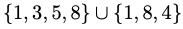
What is the result?
A. {1, 3, 4, 5, 8}

Q. 
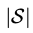
What does this return?
A. The number of elements in set S 

Q. How do we denote the number of elements in set S?
A. 

Q. What does the dot product of two vectors return?
A. The sum of all attributes multiplied

Q. 
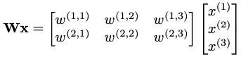
What is the next step of this multiplication?
A. 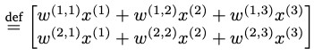

Q. What data type does matrix · vector result in?
A. A vector

Q. 
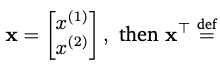
A. 
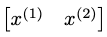

Q. 
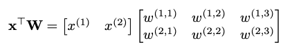
What is the next step of this multiplication?
A. 
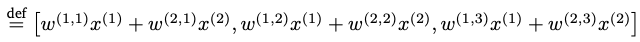

Q. 
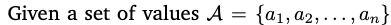, 
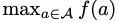 returns
A. The highest value f(a) for any item in A

Q. , 
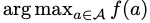 returns
A. The value of the item in A that maximises f(a)

Q. 
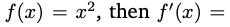
A. 2x

Q. 
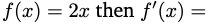
A. 2

Q. 
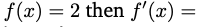
A. 0

Q. 

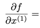
A. 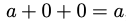

Q. 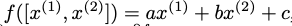

A. 
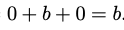

Q. What is the gradient of f defined by? (No need to compute or reduce) . 
A. 

Q. How do we denote the gradient of a function f?
A.

Q. What does this denote? 
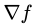
A. The gradient of a function f

Q. 
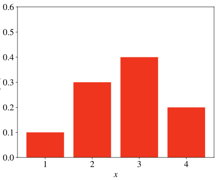
We have a set of probabilities for a set of values. What is this called?
A. A probability mass function 

Q. How do we denote a random variable?
A. /A/, capitalised and italicised

Q. What can we assume from the denotion /X/?
A. X is a random variable

Q. Which variables have probability density functions?
A. Continuous random variables

Q. What is the name of a function that describes a continuous random variable’s probabilities?
A. With a probability density function

Q. What is a function’s co-domain?
A. The possible values of its output

Q. What is a function’s domain?
A. The possible values of its inputs

Q. How is a hyperparameter different than a parameter?
A. A hyperparameter affects the algorithm itself, a parameter is learned by the algorithm

Q. How does regression differ from classification?
A. Regression predicts a value, classification predicts a class

## Backlinks
* [[§Machine Learning]]
	* [[ML notation]]

<!-- {BearID:92B62258-D993-4A08-8869-C76BCA655764-1131-00000259EBF18240} -->
