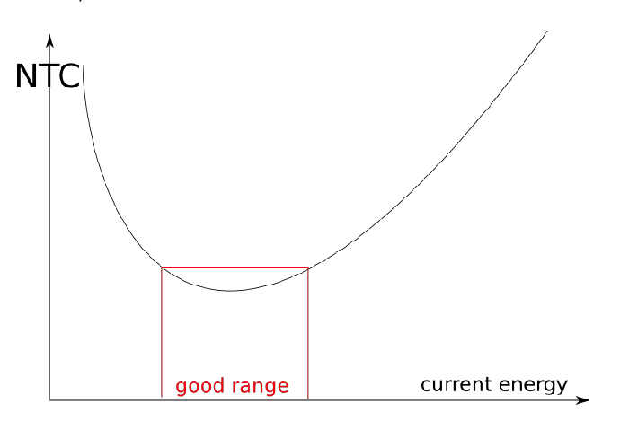

# Match activities to your energy level
This is a consequence of [[Neutral hours]] – the time cost of an activity depends on your current energy state.

Roughly speaking, the shape of the curve is dependent on:
1. How much more productive you are at higher energy levels (pushes the valley to the right)
2. How tired you get for each unit of work

E.g. if you're very low energy, it's expensive to do something hard – it takes much longer!

On the other end of the spectrum, when you're very high energy, it's expensive to do something that doesn't require energy. It's hard to reach that high-energy, focused state again, so the neutral-hours required to reach it back has to be factored in for the cost of the activity.

This means you get a curve like this.

But this curve depends on the task – e.g. for writing difficult material, the good range is at pretty high surplus energy.

## Backlinks
* [[Neutral hours]]
	* [[Match activities to your energy level]]

<!-- #p1 -->

<!-- {BearID:0D098793-C89A-4CBD-94FB-05E733437BD9-17306-00003830F9DCEFCF} -->
