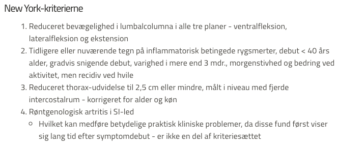
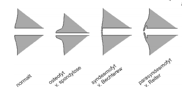

# Mb. Bechterew
## Generelt
Spondylitis ankulopoietica, [[Ankyloserende spondylitis (brug Bechterew)]]

## Differentialdiagnose

## Udredning
### Anamnese
Q. Hvad er de anamnestiske tegn på [[Mb. Bechterew]]?
A. 1) Persisterende lænde-rygsmerter, 2) Bedring ved fysisk aktivitet, 3) Morgenstivhed, 4) Sacroilit, 5) Ømhed ved senetilhæftninger ([[Entesitis]])

### Objektiv us.
Q. Du mistænker din pt. har [[Mb. Bechterew]]. Hvad vil du tilføje til din objektive us.?
A. 1) Inspektion af øjne OBS [[Anterior uveitis]], 2) St.p. (arrytmi/stenose) + st.c. (fibrose), 3) Undersøgelse af perifære led OBS [[Synovitis]], 4) Palpation af akilles- og fascia-plantaristilhæftning på calcaneus

### Paraklinik
Q. Du mistænker din pt. har [[Mb. Bechterew]]. Hvordan stilles diagnosen sikkert?
A. Rtg. med sacroilit

Q. Hvad ses på rtg. ved [[Mb. Bechterew]]?
A. Syndesmofytter

Q. Hvordan adskiller syndesmofytter sig fra osteofytter?
A. 

## Behandling

## Opfølgning

## Prognose
 

## Backlinks
* [[Mb. Bechterew]]
	* Q. Hvad er de anamnestiske tegn på [[Mb. Bechterew]]?
	* Q. Du mistænker din pt. har [[Mb. Bechterew]]. Hvad vil du tilføje til din objektive us.?
	* Q. Du mistænker din pt. har [[Mb. Bechterew]]. Hvordan stilles diagnosen sikkert?
	* Q. Hvad ses på rtg. ved [[Mb. Bechterew]]?
* [[Kyfose]]
	* Q. Hvad er de primære årsager til [[Kyfose]]?

<!-- #anki/tag/med/Rheumatology #anki/deck/Medicine #anki/tag/med/Orto -->

<!-- {BearID:39D00A13-8529-43D3-8A28-82BCD012756B-340-0000056E5F3C0EE8} -->
