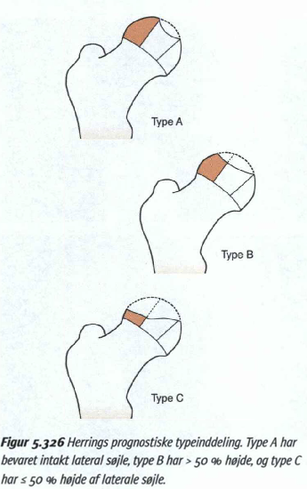
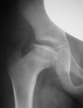
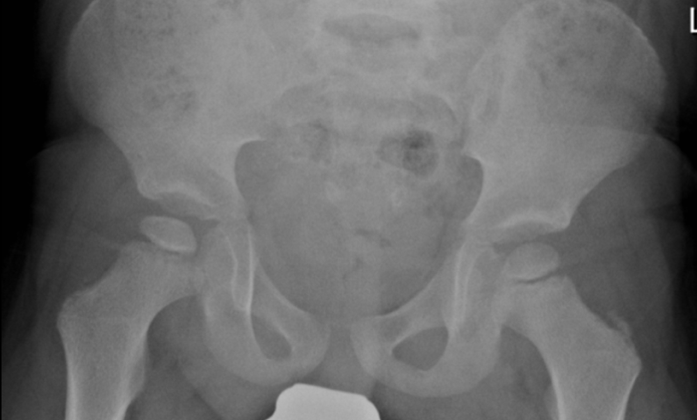
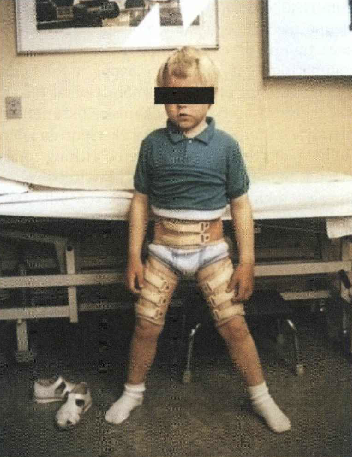
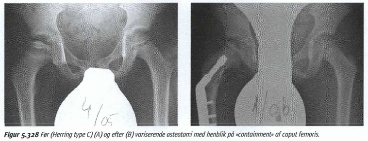

# Mb. Calve-Legg-Perthe
Coxa plana, osteochondrosis coxae juvenilis.

## Generelt
Idiopatisk [[Avaskulær nekrose]] af caput femoris. 3-11 års alderen.

Q. Du mistænker din patient har [[Mb. Calve-Legg-Perthe]]. Forældrene vil gerne vide forløbet. Hvad siger du?
A. 
4 stadier: 1) Kondensation, 2) Fragmentering, 3) Tidlig opheling, 4) Sen opheling

3 typer:

A har bedst prognose da lateral kortex beskytter:
1. Under opheling
2. Mod luksation

## Differentialdiagnose
[[Hypothyreose (myxødem)]]

## Udredning
### Anamnese
Q. Hvilke ting i anamnesen vil tyde på *[[Mb. Calve-Legg-Perthe]]*? 
A. 1) Halten, 2) Hoftesmerter, 3) Knæsmerter

### Objektiv us.

### Paraklinik
Q. Hvad ses her?

A. [[Mb. Calve-Legg-Perthe]], [[Avaskulær nekrose]] af hofte

Q. Hvad ses her?

A: [[Mb. Calve-Legg-Perthe]] på højre side, let sklerosering og substanstab.

Q. Hvordan kan man diagnosticere [[Mb. Calve-Legg-Perthe]] i det tidlige stadie?
A. MR

Q. Hvordan ser [[Mb. Calve-Legg-Perthe]] ud på rtg. i det tidlige stadie?
A. Let breddeøget ledspalte (ødem)

## Behandling
Q. Hvordan behandles [[Mb. Calve-Legg-Perthe]]?
A. 1) Smertestillende (NSAID) og støtte (stokke/kørestol). 2) *Beskyttelse*: A) Abduktionsortose eller B) Variserende osteotomi

## Opfølgning

## Prognose
 

## Backlinks
* [[Hoftedysplasi]]
	* Primær
	[[Hofteepifysiolyse]]
	[[Mb. Calve-Legg-Perthe]]
	[[Kongenit hofteluksation]]
	[[Caputnekrose]]
	[[Oligohydramnios]]
* [[Mb. Calve-Legg-Perthe]]
	* Q. Du mistænker din patient har [[Mb. Calve-Legg-Perthe]]. Forældrene vil gerne vide forløbet. Hvad siger du?
4 stadier: 1) Kondensation, 2) Fragmentering, 3) Tidlig opheling, 4) Sen opheling
	* Q. Hvilke ting i anamnesen vil tyde på *[[Mb. Calve-Legg-Perthe]]*? 
	* Q. Hvad ses her?
A. [[Mb. Calve-Legg-Perthe]], [[Avaskulær nekrose]] af hofte
	* Q. Hvad ses her?
A: [[Mb. Calve-Legg-Perthe]] på højre side, let sklerosering og substanstab.
	* Q. Hvordan kan man diagnosticere [[Mb. Calve-Legg-Perthe]] i det tidlige stadie?
	* Q. Hvordan ser [[Mb. Calve-Legg-Perthe]] ud på rtg. i det tidlige stadie?
	* Q. Hvordan behandles [[Mb. Calve-Legg-Perthe]]?
* [[Det haltende barn]]
	* [[Mb. Calve-Legg-Perthe]]
* [[Skadestueradiologi]]
	* Q. Hvad ses her?
A. Epifysiolyse, caput er skredet lidt. Hofte, derfor nok [[Mb. Calve-Legg-Perthe]].

<!-- #anki/tag/med/Orto #anki/deck/Medicine -->

<!-- {BearID:6F1AD873-E20F-4C3D-B10B-D65B05F02662-819-00000268755DB155} -->
