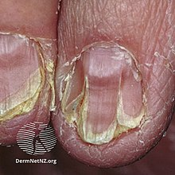
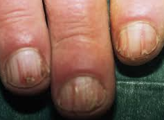

# Mb. Darier
## Generelt

## Differentialdiagnose

## Udredning
### Anamnese

### Objektiv us.
Q. Beskriv – Diagnose(r)?

A. Længdeforløbende indhak i negle - [[Mb. Darier]]

Q. Beskriv – Diagnose(r)?

A. Længdeforløbende indhak i negle - [[Mb. Darier]]

### Paraklinik

## Behandling

## Opfølgning

## Prognose

<!-- #anki/tag/med/Derma #anki/deck/Medicine -->

## Backlinks
* [[Mb. Darier]]
	* Q. Beskriv – Diagnose(r)?
A. Længdeforløbende indhak i negle - [[Mb. Darier]]
	* Q. Beskriv – Diagnose(r)?
A. Længdeforløbende indhak i negle - [[Mb. Darier]]
* [[Medfødte hudsygdomme (genodermatoser)]]
	* [[Epidermolysis bullosa]]
[[Keratosis pilaris]]
[[Palmoplantar keratodermi]]
[[Mb. Darier]]
[[Neurofibromatose]]

<!-- {BearID:79861842-B0CE-4B14-8E0C-A1F9CBB7A853-21052-0000430F789497C2} -->
