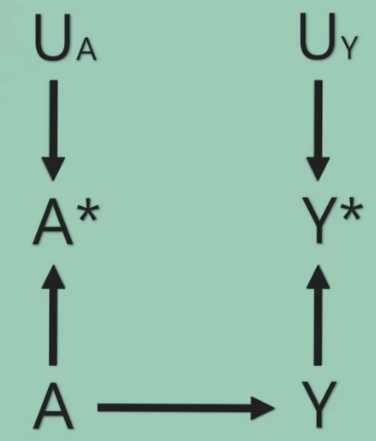
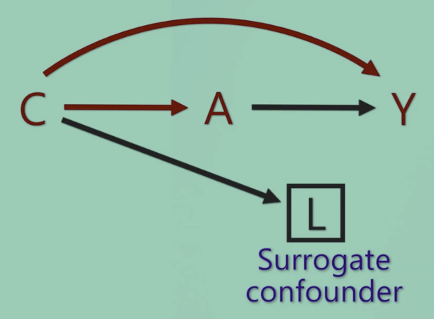

# Measurement error

A er den sande værdi af eksponeringen. A* er den målte værdi.

Y er den sande værdi af udfaldet.

Ua er alle faktorer der påvirker det målte A (A*), som ikke er A.

Correcting for measurement error:
* Validation sample
	* Eg. Use a better method on a sub-sample, to check the validity of the lesser method – and potentially to correct for biased estimates
* Statistical method

Q. 
Should we condition on L?

A. Yes, it partially adjusts for C.

## Backlinks
* [[§Causal inference]]
	* [[Measurement error]]

<!-- {BearID:1192393A-A340-48C1-87B0-FE4E8944E9C1-23630-00003464791BECB6} -->
