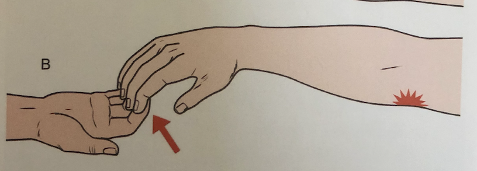

# Medial epicondylitis
## Generelt
Q. Hvad hedder *[[Medial epicondylitis]]* i daglig tale? 
A. *Golfalbue*

Q. Hvad hedder *Golfalbue* i sundhedsvæsenet? 
A. *[[Medial epicondylitis]]* 

Også kendt som golfalbue.

Langt mindre generende end [[Lateral epicondylitis]], behandles med NSAID-gel. 

## Differentialdiagnose
[[Cubitaltunnelsyndrom]]
[[§Artrose]]
Traume

## Udredning
### Anamnese

### Objektiv us.

### Paraklinik

## Behandling
Q. Hvordan behandles [[Medial epicondylitis]]?
A. 1) [[NSAID]], 2) Steroidblokade og fysioterapi, 3) Kirurgi med overskæring af tilhæftet

85% bedres spontant indenfor 2 år.

## Opfølgning

## Prognose

## Backlinks
* [[§Albue]]
	* [[Medial epicondylitis]]
* [[Medial epicondylitis]]
	* Q. Hvad hedder *[[Medial epicondylitis]]* i daglig tale? 
	* Q. Hvad hedder *Golfalbue* i sundhedsvæsenet? 
	* Q. Hvordan behandles [[Medial epicondylitis]]?

<!-- #anki/tag/med/Orto #anki/deck/Medicine #anki/tag/med/GP -->

<!-- {BearID:9BA7E5BE-2712-474D-A1D4-5EF502A9FDC7-53319-000070D14AC84079} -->
