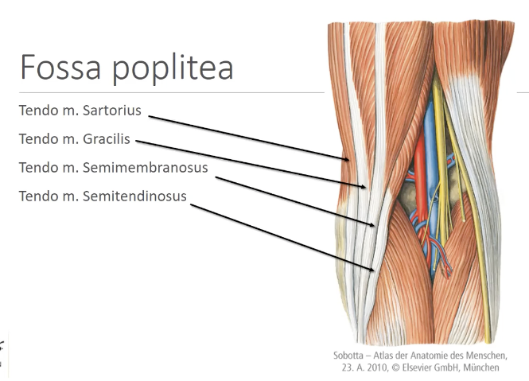

# Median haserefleks
## Generelt
Q. Hvilken muskel slår man på ved [[Median haserefleks]]?
A. Semitendinosus

## Differentialdiagnose

## Udredning
### Anamnese

### Objektiv us.

### Paraklinik

## Behandling

## Opfølgning

## Prognose
 

## Backlinks
* [[Median haserefleks]]
	* Q. Hvilken muskel slår man på ved [[Median haserefleks]]?

* [[Lumbal diskusprolaps]]
	* Q. Du mistænker din patient for [[Lumbal diskusprolaps]]. Hvad skal tilføjes til den objektive undersøgelse?
	* Q. Hvad er *objektive fund* ved udfald af L5-roden?

<!-- #anki/tag/med/Orto #anki/deck/Medicine #anki/tag/med/Neurosurgery -->

<!-- {BearID:D2DB1593-48B6-47ED-9486-AD5199477D19-18513-00001B105111A911} -->
