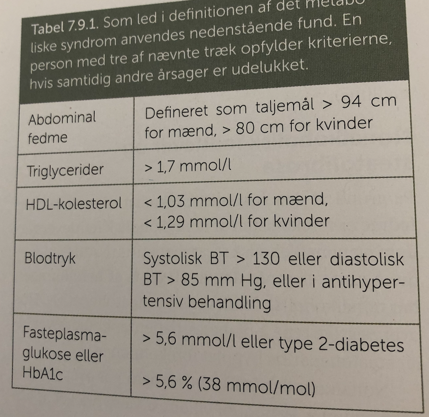

# Metabolisk syndrom
## Generelt
Karakteriseret ved:

Q. Hvilke elementer indgår i [[Metabolisk syndrom]]?
A. 1) Abdominal fedme, 2) Høj FFA, 3) Lav HDL, 4) Forøget faste-glukose, 5) Hypertension

## Differentialdiagnose

## Udredning
### Anamnese

### Objektiv us.

### Paraklinik

## Behandling

## Opfølgning

## Prognose

## Backlinks
* [[Metabolisk syndrom]]
	* Q. Hvilke elementer indgår i [[Metabolisk syndrom]]?

<!-- #anki/tag/med/Endocrinology #anki/deck/Medicine -->

<!-- {BearID:37A9D47A-311F-4C25-A2EB-4DB68E06CEE2-7035-000017DD8FA42A49} -->
