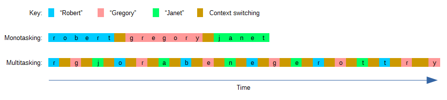
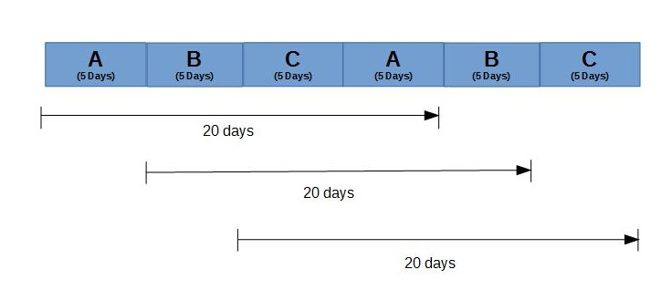

# Minimise multitasking

Q. Why does decreased multitasking lead to increased efficiency?
A. It decreases lag time and it decreases context switching.

## Backlinks
* [[Decrease lag time]]
	* How, then, do we decrease lag time? Some of the answer is probably in [[Optimise the critical chain]], much of it is in [[Minimise multitasking]]

<!-- {BearID:1F109462-53A5-4736-B331-8A21A94AAD82-2923-000007E5BD556F7E} -->
