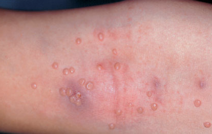
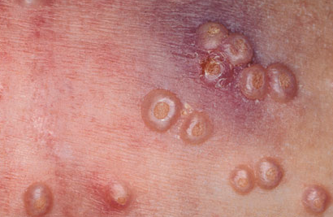
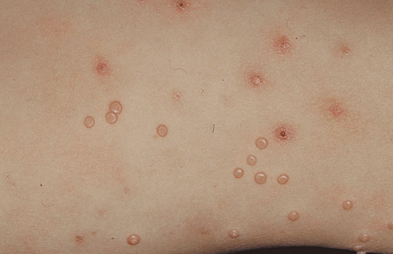

# Molluscum contagiosum
## Generelt

Q. Beskriv eksantemet. Diagnose?
 
A. Multiple klare papler uden væsentlig erytem, men med central umbodannelse - [[Molluscum contagiosum]]

Q. Beskriv eksantemet. Diagnose?

A. Multiple klare papler uden væsentlig erytem, men med central umbodannelse - [[Molluscum contagiosum]]

Q. Beskriv eksantemet. Diagnose?

A. Multiple klare papler uden væsentlig erytem, men med central umbodannelse - [[Molluscum contagiosum]]

Q. Din patient har [[Molluscum contagiosum]]. Hvordan påvirker det børnehave?
A. Ingen påvirkning.

## Differentialdiagnose

## Udredning
### Anamnese
Q. Hvor lang tid står et [[Molluscum contagiosum]] element typisk?
A. Måneder til år

### Objektiv us.

### Paraklinik

## Behandling
Q. Hvordan behandles [[Molluscum contagiosum]] typisk?
A. Lad stå. Ellers curettage eller frysning.

Q. Under hvilke omstændigheder behandles [[Molluscum contagiosum]]?
A. Skæmmende placering

Q. Hvorfor behandles [[Molluscum contagiosum]]? 
A. Undgå smitte til selv og andre

## Opfølgning

## Prognose

## Backlinks
* [[Molluscum contagiosum]]
	* Q. Beskriv eksantemet. Diagnose?
A. Multiple klare papler uden væsentlig erytem, men med central umbodannelse - [[Molluscum contagiosum]]
	* Q. Beskriv eksantemet. Diagnose?
A. Multiple klare papler uden væsentlig erytem, men med central umbodannelse - [[Molluscum contagiosum]]
	* Q. Beskriv eksantemet. Diagnose?
A. Multiple klare papler uden væsentlig erytem, men med central umbodannelse - [[Molluscum contagiosum]]
	* Q. Din patient har [[Molluscum contagiosum]]. Hvordan påvirker det børnehave?
	* Q. Hvor lang tid står et [[Molluscum contagiosum]] element typisk?
	* Q. Hvordan behandles [[Molluscum contagiosum]] typisk?
	* Q. Under hvilke omstændigheder behandles [[Molluscum contagiosum]]?
	* Q. Hvorfor behandles [[Molluscum contagiosum]]? 
* [[Tumorer i huden]]
	* [[Keratinocyt]]
	[[Keratoakantom]]
	[[Milier]]
	[[Verruca vulgaris]]
	[[Kønsvorter (brug Condyloma acuminata)]]
	[[Molluscum contagiosum]]
* [[Børneinfektioner i huden]]
	* [[Molluscum contagiosum]]

<!-- #anki/tag/med/Derma #anki/deck/Medicine #anki/tag/med/GP #anki/tag/med/Infectious -->

<!-- {BearID:C57AE98C-3D29-4F26-A039-EFDBAEF63B5A-62499-00007E8EAC7233AC} -->
