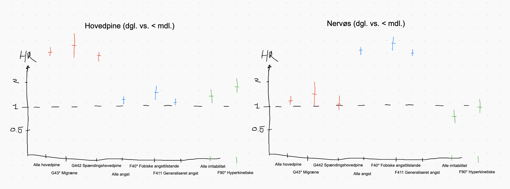

# NSSS: Hvilke diagnoser vil vi kigge på
Vi kan gruppere diagnoserne, eller vi kan tage de største og kigge på dem alene.

At gruppere giver os mere power, men kan give os en del problemer ift. Heterogeniteten internt i gruppen (eg. Hortons hovedpine ift. spændingshovedpine).

Spørgsmålet er så, om vi har events nok af de mindre sjældne diagnoser. Det må jeg nok hellere tjekke i data.

Fremgagsmåden nu er:
1. Identificer diagnoser
	1. Face validity 
	2. Clinical experience and diagnostic criteria (Charlotte)
2. Udvælg diagnoser
	1. Prevalence and DALY

### Diagnoser

### Hovedpine:
* G440* Hortons hovedpine
	* G440A Episodisk klyngehovedpine
	* G440B Kronisk paroksysmal hemikranii
* G442 Spændingshovedpine
* G43* Migræne
* G444 Lægemiddelshovedpine
* G50* Trigeminusneuralgi

### Mavepine:
https://www.sundhed.dk/sundhedsfaglig/information-til-praksis/hovedstaden/almen-praksis/patientforloeb/forloebsbeskrivelser-icpc/d-fordoejelsesorganer/spaendingsmavepine-boern/
* E73* Laktoseintolerans
* K50* Mb. Crohn
* K58* Irritabel tyktarm
* K590*  Forstoppelse
* K80* Galdesten
* K900 Cøliaki

### Irritabilitet:
[The global burden of conduct disorder and attention-deficit/hyperactivity disorder in 2010 PubMed](https://pubmed.ncbi.nlm.nih.gov/24447211/)
https://www.ncbi.nlm.nih.gov/pmc/articles/PMC5269491/
[Severe Mood Dysregulation, Irritability, and the Diagnostic Boundaries of Bipolar Disorder in Youths](https://www.ncbi.nlm.nih.gov/pmc/articles/PMC3396206/)
* F602 Dyssocial personlighedsstruktur
* F90* Hyperkinetiske forstyrrelser
* F91* Adfærdsforstyrrelser

### Angst: (5.5%% af DALY)
* F40* Fobiske angsttilstande
* F411 Generaliseret angst
* F412 Lettere angst-depressionstilstand
* F419Angsttilstand UNS
* F4322  Blandet angst-depressiv tilpasningsreaktion
* F606 Ængstelig personlighedsstruktur
* F9380Generel angsttilstand i barndommen

### Søvnproblemer
* G470* Insomni
* G472* Forstyrret søvnrytme

### Ked af det:
* F32* Depressiv enkeltepisode
* F33* Periodisk depression

### Dizzyness

<!-- {BearID:6F57FB33-2530-4474-BCA4-15FCCAE91F1C-19308-0000268D02FC1868} -->
