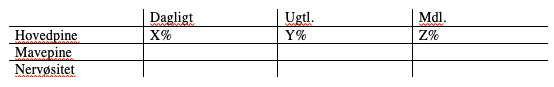

# NSSS
[[Pitch 1: Symptoms as markers of disease]]
[[Pitch 2: Symptoms as markers of some latent traits]]

*The solution*
As a table 2 or similar, we want:

Der er et par spørgsmål vi vil besvare:
1.	Er associationen mellem hospitalsdiagnose og symptom den samme på tværs af symptomer? (Hvis ja, symptomerne kan opfattes som en gruppe. Hvis nej, skal de opfattes som flere grupper på trods af PCA der viser fit som 1 og 2 faktorer.) 

[[Justere for andre symptomer]]
[[Vil vi have en grafik]]
* [[NSSS: Hvordan vil vi lave analyserne]]
	* [[Skal vi bruge diagnoser eller medicin]]
	* [[NSSS: Hvilke diagnoser vil vi kigge på]]

After that, estimate association between a given symptom (high vs. low) and each chapter, when adjusting for all other symptoms. Repeat for each symptom.

Can be used to generate a set of line diagrams, probably IRR ratios rather than KIP ratios given uneven distribution of risk time:

Association between symptom (high vs. low) and diagnosis-chapter, split by symptom. Estimated by IRR. 
 
*Challenges/limitations*
* 	Vi kan relativt nemt lave p-værdier for tabellen, (chi-i-anden). Det kan være svært at kvantificere “ændret mønster” for diagnose 1 vs. diagnose 2 etc. på regressionen. 
* 	Stefan, hvis vi bliver afkrævet en p-værdi på “mønsteret af ratioer”, er det så noget vi kan komme op med?

*Does this solve the problem?*
If symptoms are strongly differentially associated with different diagnoses, it indicates that they are different entities. This means that they can have differential causes and may need differential study and intervention.

If not, it indicates that they are part of general illness-perception.  This means that they may have similar causes and may be studied and intervened upon as a whole.

We examine both hypotheses in our study.

This can be something like “non-specific symptoms and non-specific outcomes – an exploration into the grey area of the hospital system”.

<!-- {BearID:7E4CD9A0-C682-4F43-B424-C5D7A4EB17CC-9892-00000D15FAA50244} -->
