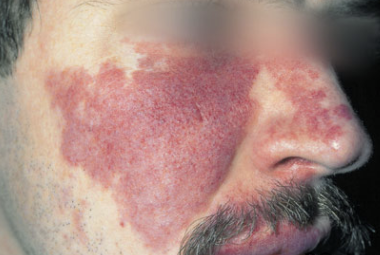

# Naevus flammeus (portvinsmærke)
## Generelt
Også kendt som erythema nuchae.

Portvinsmærker. 0,3-0,5% af nyfødte.

Q. Hvad hedder *Naevus flammeus* på dansk? 
A. *Portvinsmærker*

Q. Hvad hedder *Portvinsmærker* på latin? 
A. *Naevus flammeus* 

## Differentialdiagnose
Q. Hvordan adskilles [[Naevus flammeus (portvinsmærke)]] fra [[Kapillært hæmangiom (storkebid)]]?
A. [[Naevus flammeus (portvinsmærker)]] er 1) Skarpt afgrænsede, 2) Mere overfladiske og 3) Mere intense 

Ekstra OBS hvis:
1. I n. trigeminus' innervationsområde (OBS: intrakranielle vaskulære misdannelser)
2. Omfattende nævi på ekstremiteter (OBS: [[Sturge-Weber syndrom]])

Hvis det har en hurtig vækstfase (pludseligt) , eller har lidt "fylde", [[Kavernøst hæmangiom]].

## Udredning
### Anamnese

### Objektiv us.
Q. Hvad ses her?

A. [[Naevus flammeus (portvinsmærker)]]

### Paraklinik

## Behandling
Hvis kosmetisk uacceptable, laserterapi. Forsvinder ikke spontant.

## Opfølgning

## Prognose

## Backlinks
* [[Naevus flammeus (portvinsmærke)]]
	* Q. Hvordan adskilles [[Naevus flammeus (portvinsmærke)]] fra [[Kapillært hæmangiom (storkebid)]]?
* [[Tumorer i huden]]
	* *Blodkar*
	[[Infantilt hæmangiom]]
	[[Pyogent granulom]]
	[[Naevus flammeus (portvinsmærke)]]
	[[Angiokeratom]]
	[[Kaposis sarkom]]
* [[Infantilt hæmangiom]]
	* [[Kavernøst hæmangiom]]
[[Naevus flammeus (portvinsmærke)]]
	* Q. Hvilke typer [[Infantilt hæmangiom]] findes der?
* [[Spot-test]]
	* Q. Hvad ses her?
A. [[Naevus flammeus (portvinsmærke)]]

<!-- #anki/tag/med/Derma #anki/deck/Medicine #anki/tag/med/GP# #anki/tag/med/Pediatrics -->

<!-- {BearID:3F33F8EB-A8B5-46C0-903F-9D0C4F75CA4D-62499-00007E4C16A09E39} -->
