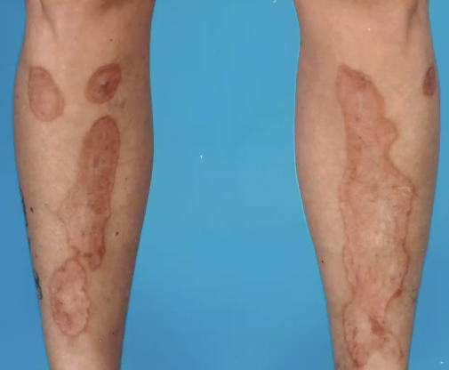

# Necrobiosis lipoidica
## Generelt

## Differentialdiagnose

## Udredning
### Anamnese

### Objektiv us.
Q. Beskriv eksantemet – Diagnose(r)?

A. Makulære, hårde elementer med randhærdning- [[Necrobiosis lipoidica]]

### Paraklinik

## Behandling

## Opfølgning

## Prognose

<!-- #anki/tag/med/Derma #anki/deck/Medicine #1. med/gap# -->
## Backlinks
* [[Necrobiosis lipoidica]]
	* A. Makulære, hårde elementer med randhærdning- [[Necrobiosis lipoidica]]

<!-- {BearID:7747B63C-CA65-41E6-B56D-CFD77ABCDE6A-12063-00002C6D7E2F236C} -->
