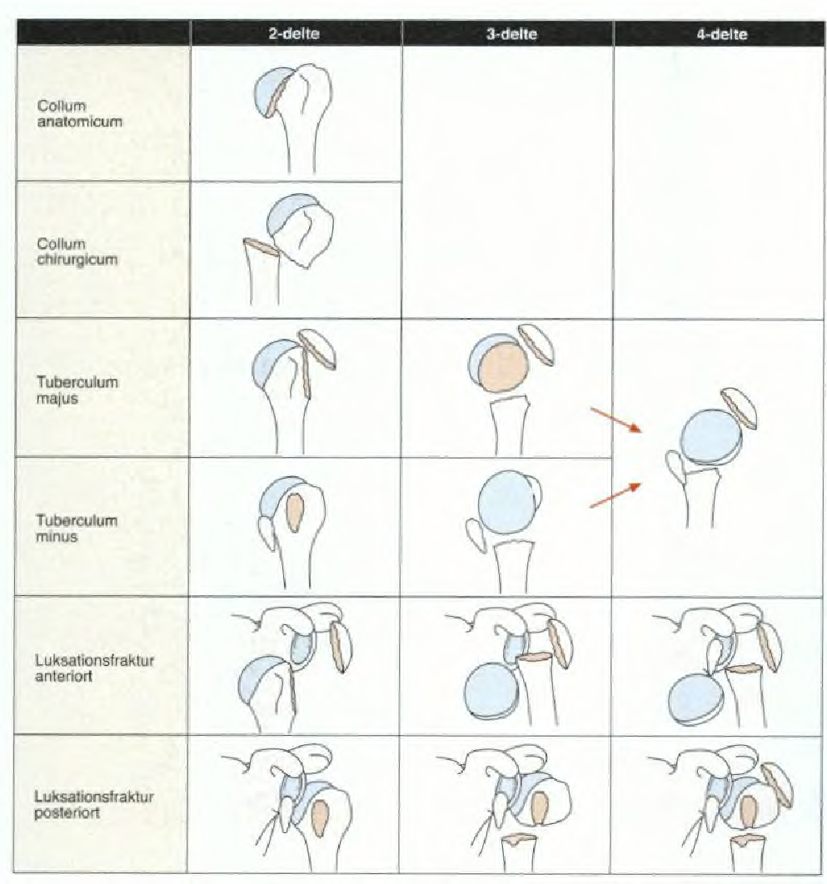
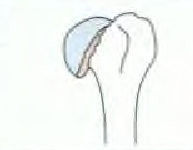
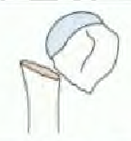

# Neers klassifikation
## Generelt

Q. Hvad hedder dette?

A. Collum anatomicum

Q. Hvad hedder dette?

A. Collum chirurgicum

## Differentialdiagnose

## Udredning
### Anamnese

### Objektiv us.

### Paraklinik

## Behandling

## Opfølgning

## Prognose
 

## Backlinks
* [[Proksimal humerusfraktur]]
	* Opdeles ad modum Neer ([[Neers klassifikation]]).

<!-- #anki/tag/med/Orto #anki/deck/Medicine -->

<!-- {BearID:41110C50-72F4-4A89-B4F7-8E3D92948AF0-27973-00003FB4D485729C} -->
